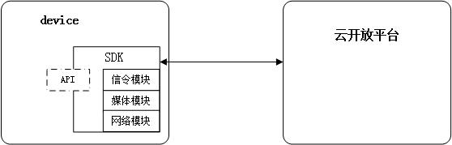
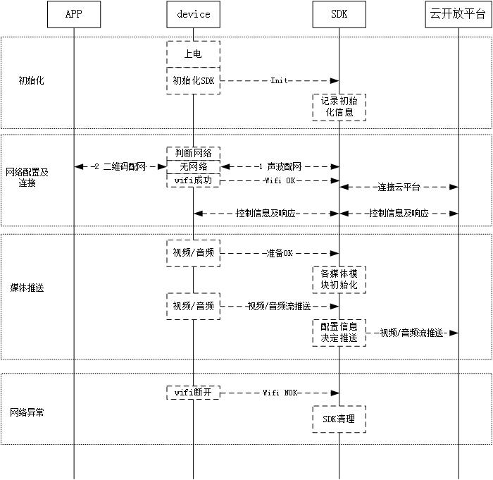

# 一、设备端开放SDK集成接口说明
**本文档描述了开放SDK与本地视音频设备之间的交互接口， 通过本说明，本地视音频设备可以通过SDK提供的统一接入能力接入到开放云平台，提供相应的服务及设置。**

   
# 二、接口文档概述
## 开放SDK在系统中的位置

## 开放SDK流程简述

## 开放SDK内容介绍
### 头文件

### 库文件 

# 三、接口详细描述
## 1、 SDK初始化
### 接口定义
**`int32_t OVDInit(OVD_DEVType type, OVC_NETParm netParam, OVD_CallBackFunList *pCallBackFunList)`**

### 参数说明：
    [in]type:              设备类型，详细可见枚举类型RT_DevType
    [in]netParam:          云服务器地址及端口号，见OVC_NETParm结构体
    [in]pCallBackFunList:  提供给服务器端调用的回调函数，以相应服务器端的请求，见OVD_CallBackFunList。   注：若未提供相关的回调函数，则相关请求被丢弃，及设备端不提供对应的功能。
### 返回值：
    成功：0
    失败：其他值
### *附加说明*
    无

## 2、开启服务（wifi连接成功后调用）
### 接口定义
**`void OVDSerivceStart()`**
### 参数说明：
    无
### 返回值：
    无
### *附加说明*
    无

## 3、关闭服务（wifi断线时调用）
### 接口定义
**`void OVDSerivceStop()`**
### 参数说明：
    无
### 返回值：
    无
### *附加说明*
    无

## 4、告警接口
### 4.1 告警开始
### 接口定义
**`int32_t OVDAlarmInfoStart(OVD_UpLoadAlarmInfo alarmInfo)`**
### 参数说明：
    [in]alarmInfo:    报警信息结构体，详细可见结构体描述OVD_UpLoadAlarmInfo
### 返回值：
    成功：0
    失败：其他值
### *附加说明*
    无
    
### 4.1 告警结束
### 接口定义
**`int32_t OVDAlarmInfoEnd(OVD_IdentifyType alarmType,uint32_t endTimeStamp)`**
### 参数说明：
    [in]alarmType:    告警类型，详细可见枚举OVD_IdentifyType
### 返回值：
    成功：0
    失败：其他值
### *附加说明*
    无

## 5、音视频内容接口
### 5.1 音视频内容准备传送接口
### 接口定义
**`int32_t OVDAudioOrVideoStart(uint8_t channel,OVD_ContentType contentType,EncodeMode eCodeMode,uint32_t SuggestBitRate,OVDVideoDataFormat* videoinfo)`**
### 参数说明：
    [in]channel:         通道号
    [in]contentType:     准备传送的内容，详见枚举值OVD_ContentType
    [in]eCodeMode:       视频清晰度，详细可见枚举类型EncodeMode
    [in]SuggestBitRate:  建议码率(可忽视)
    [in]videoinfo:       视频信息,详见结构体OVDVideoDataFormat
### 返回值：
    成功：0
    失败：其他值
### *附加说明*
    无

### 5.2 音视频内容推送接口
### 接口定义
**`int32_t OVDAudioOrVideoPushData(uint8_t channel,char isIFrame,void* contentData, uint32_t videoDataLen,uint32_t timestamp)`**
### 参数说明：
    [in]channel:         通道号
    [in]isIFrame:        是否是I帧  0：不是 1：是
    [in]contentData:     发送数据的首字节指针
    [in]videoDataLen:    本次发送数据的长度
    [in]timestamp:       该帧时间戳(ms)
### 返回值：
    成功：0
    失败：其他值
### *附加说明*
    无

### 5.3 音视频内容传送结束接口
### 接口定义
**`int32_t OVDAudioOrVideoEnd(uint8_t channel)`**
### 参数说明：
    [in]channel:         通道号
### 返回值：
    成功：0
    失败：其他值
### *附加说明*
    无

## 6、录像回放内容推送接口
*录像内容查询、打开录像文件、录像文件控制、录像删除等功能，由回调函数定义，详见（SDK初始化）的参数定义*
### 接口定义
**`int32_t OVDSendRecordVedioOrAudioContent(uint8_t channel,uint8_t contentType,char isIFrame,char isIFrame,void* contentData,uint32_t videoDataLen,uint32_t timestamp)`**
### 参数说明：
    [in]channel:         通道号
    [in]contentType:     内容类型   0：视频内容 1：音频内容
    [in]isIFrame:        是否是I帧  0：不是 1：是
    [in]contentData:     发送数据的首字节指针
    [in]videoDataLen:    本次发送数据的长度
    [in]timestamp:       该帧时间戳(ms)
### 返回值：
    成功：0
    失败：其他值
### *附加说明*
    无

## 7、声波配置网络接口
### 7.1 声波初始化
### 接口定义
**`void* OVDSoundWaveInit(int sampleRate,int bitWidth)`**
### 参数说明：
    [in]sampleRate:      采样率
    [in]bitWidth:        位宽(8/16bit)
### 返回值：
    成功：返回声波句柄
    失败：NULL
### *附加说明*
    无

### 7.2 开始声波识别
### 接口定义
**`int32_t OVDSoundWaveStart(void *recognizer,RecognizStart start_cbfunc,RecognizEnd end_cbfunc)`**
### 参数说明：
    [in]recognizer:      声波句柄
    [in]start_cbfunc:    识别开始回调函数
    [in]end_cbfunc:      识别结束回调函数（此函数返回wifi信息）
### 返回值：
    成功：0
    失败：其他值
### *附加说明*
    无

### 7.3 采集到的声波数据，写入识别器
### 接口定义
**`int32_t OVDSoundWaveWriteData(void *recognizer,const void *data,unsigned long len)`**
### 参数说明：
    [in]recognizer:      声波句柄
    [in]data:            声波数据的首字节指针
    [in]len:             声波数据长度
### 返回值：
    成功：成功写入的数据长度
    失败：小于0的值
### *附加说明*
    无

### 7.4 停止声波识别
### 接口定义
**`int32_t OVDSoundWaveStop(void *recognizer)`**
### 参数说明：
    [in]recognizer:      声波句柄
### 返回值：
    成功：0
    失败：其他值
### *附加说明*
    无

## 8、门锁端特殊接口
### 7.1 上报门锁操作消息(开锁/增删用户/系统锁定/系统恢复出厂设置等等)
### 接口定义
**`int32_t OVDLockUploadMsgInfo(OVDLockMsgInfo lockinfo)`**
### 参数说明：
    [in]lockinfo:        锁端消息信息,详细可见结构体描述OVDLockMsgInfo
### 返回值：
    成功：0
    失败：其他值
### *附加说明*
    无

## 9、回调OVD_CallBackFunList定义及说明
### 9.1 回调结构体定义
    typedef struct{
        
        //设备端信息获取接口
		/*
        **参数说明:
        **    [out]configureInfo:    需要返回的信息，其中没有的项置为NULL，详细可见结构体描述OVDConfigration
        **    
        **返回值：
        **    成功：0
        **    失败：其他值
        */
        int32_t (*OVCGetOVDConfigureInfo)(OVDConfigration *configureInfo)

        //配置设备端信息接口
		/*
        **参数说明:
        **    [in]configureSetter:    需要设置的信息，其中没有的项置为NULL，详细可见结构体描述OVDConfigrationSetter
        **    
        **返回值：
        **    成功：0
        **    失败：其他值
        */
        int32_t (*OVCSetOVDConfigureInfo)(OVDConfigrationSetter configureSetter)

        //重启
        /*
        **参数说明:
        **    [in]isRebootDevice:    是否重启设备 0：重启设备， 1：重启channel
        **    [in]channel:           若重启channel，则为需要重启的channel。 注：如设备不支持单独重启channel，则直接重启设备。
        **    
        **返回值：
        **    成功：0
        **    失败：其他值
        */
        int32_t (*OVDReBoot)(char isRebootDevice,uint8_t channel)

        //恢复配置到出厂状态
        /*
        **参数说明:
        **    [in]iskeepNetConfigre:    是否保留wifi的网络配置，0:保留， 1:不保留
        **    
        **返回值：
        **    成功：0
        **    失败：其他值
        */
        int32_t (*OVDResetConfiguration)(char iskeepNetConfigre)

        //按页查询录像文件
        /*
        **参数说明:
        **    [in]channel:        通道号
        **    [in]recordType:     文件类型（0：视频文件 1：告警文件）
        **    [in]startStamp:     录像查询的起始时间戳(s)
        **    [in]endStamp:       录像查询的结束时间戳(s)
        **    [in]page:           查询的页码
        **    [in]numInPage:      每页的条数
        **    [in]fileInPage:     录像文件列表信息，详细可见结构体描述OVDRecordFileListPerPage
        **
        **返回值：
        **    成功：0
        **    失败：其他值
        **
        **其他说明:
        **    假设查询的录像文件数有200个，numInPage=10，则最大页码Page为20。若传进的参数numInPage=10，page=2，则fileInPage应该返回第10个到第20个录像的信息;若传进的参数numInPage=10，page=21，则fileInPage返回空录像信息(录像个数为0)                     
        */
        int32_t (*OVDQueryRecordPage)(uint8_t channel,uint8_t recordType,uint32_t StartStamp,uint32_t EndStamp,uint32_t Page,uint32_t PageNum,RTFileListPerPage_3 *FilePage)

        //打开录像文件
        /*
        **参数说明:
        **    [in]channel:         通道号
        **    [in]recordname:      录像文件名称
        **    [in]videoInfo:       视频信息,详细可见结构体描述OVDVideoDataFormat
        **    [in]audioInfo:       音频信息,详细可见结构体描述OVDAudioDataFormat
        **    [in]fileTotalTime:   该录像的时长(ms)
        **    
        **返回值：
        **    成功：0
        **    失败：其他值
        */
        int32_t (*OVDOpenRecordFile)(uint8_t channel,char* recordname,OVDVideoDataFormat* videoInfo,OVDAudioDataFormat* audioInfo,uint32_t* fileTotalTime)

        //录像文件控制
        /*
        **参数说明:
        **    [in]channel:         通道号
        **    [in]controlType:     播放控制，详细可见枚举类型CONTROLTYPE
        **    [in]value:           额外值，目前只有视频拖动时会用到，代表要跳至的视频时间戳(ms)
        **    
        **返回值：
        **    成功：0
        **    失败：其他值
        */
        int32_t (*OVDRecordCotrol)(uint8_t channel,CONTROLTYPE controlType,uint32_t value)

        //录像文件删除
        /*
        **参数说明:
        **    [in]recordname:      待删除的录像名称
        **    
        **返回值：
        **    成功：0
        **    失败：其他值
        */
        int32_t (*OVDRecordFileDelete)(char* recordname)

        //设备升级接口
        /*
        **参数说明:
        **    [in]upgradeURL:      升级固件的远程url，由设备主动去下载、升级
        **    
        **返回值：
        **    成功：0
        **    失败：其他值
        */
        int32_t (*OVDUpgradeInfo)(char upgradeURL[1024])

        //获取SD卡信息
        /*
        **参数说明:
        **    无
        **    
        **返回值：
        **    成功：存储卡信息,详细可见结构体描述OVDSDInfo
        **    失败：NULL
        */
        OVDSDInfo (*OVDGetSDInfo)()

        //格式化SD卡
        /*
        **参数说明:
        **    无
        **    
        **返回值：
        **    成功：0
        **    失败：其他值
        */
        int32_t (*OVDSetSDCardFormat)()       

        //云台控制设备
        /*
        **参数说明:
        **    [in]channel:         通道号
        **    [in]ptzcmd:          控制命令,详细可见枚举类型OVC_PTZControlCmd
        **    [out]arg:            额外参数，目前未使用
        **    
        **返回值：
        **    成功：0
        **    失败：其他值
        */
        int32_t (*OVCPTZCmd)(uint8_t channel,OVC_PTZControlCmd ptzcmd,RT_ControlArgData* arg)

        //打开对讲接口
        /*
        **参数说明:
        **    [in]encordType:      编码类型,详细可见枚举类型AUDIOPLY_TYPE
        **    [in]sampleRate:      采样率
        **    [in]bitWidth:        位宽(8/16bit)
        **    [in]volume:          声音大小(0-100)
        **    [in]priority:        优先级(越大越高，多个事务占用音频需要考虑此参数)
        **    
        **返回值：
        **    成功：0
        **    失败：其他值
        */
        int32_t (*OVDAudioPlayStart)(AUDIOPLY_TYPE encordType,int32_t sampleRate,int32_t bitWidth,uint32_t volume,int priority)

        //播放对讲音频
        /*
        **参数说明:
        **    [in]buf:      音频数据指针
        **    [in]size:     音频数据大小
        **    
        **返回值：
        **    成功：0
        **    失败：其他值
        */
        int32_t (*OVDAudioPlayProGress)(uint8_t* buf, int32_t size)

        //关闭对讲接口
        /*
        **参数说明:
        **    无
        **    
        **返回值：
        **    成功：0
        **    失败：其他值
        */
        int32_t (*OVDAudioPlayStop)()

        //强制出I帧
        /*
        **参数说明:
        **    无
        **    
        **返回值：
        **    成功：0
        **    失败：其他值
        */
        int32_t (*OVDForceIFrame)()

        //音乐播放
        /*
        **参数说明:
        **    [in]url:          歌曲下载的url
        **    [in]priority:     优先级(越大越高，多个事务占用音频需要考虑此参数)
        **    
        **返回值：
        **    成功：0
        **    失败：其他值
        */
        int32_t (*OVDSetMp3Url)(char url[1024],int priority)

        //音乐播放控制
        /*
        **参数说明:
        **    [in]ctrl:         播放控制,详细可见枚举类型OVD_Mp3PlayCtrl
        **    
        **返回值：
        **    成功：0
        **    失败：其他值
        */
        int32_t (*OVDMp3PlayCtrl)(OVD_Mp3PlayCtrl ctrl)

        //获取音乐播放状态
        /*
        **参数说明:
        **    [out]url:         正在播放的歌曲的下载url
        **    
        **返回值：
        **    成功：0
        **    失败：其他值
        */
        int32_t (*OVDGetMp3PlayStatus)(char url[1024])

        //设置门锁端的时间
        /*
        **参数说明:
        **    [in]timeInfo:         设置时间,详细可见结构体描述OVDDateTime
        **    
        **返回值：
        **    成功：0
        **    失败：其他值
        */
        int32_t (*OVDSetLockTime)(OVDDateTime timeInfo)

        //获取门锁端的时间
        /*
        **参数说明:
        **    [out]timeInfo:         获取锁端时间,详细可见结构体描述OVDDateTime
        **    
        **返回值：
        **    成功：0
        **    失败：其他值
        */
        int32_t (*OVDGetLockTime)(OVDDateTime *timeInfo)

    }OVD_CallBackFunList;

## 10、附加定义及说明
    typedef struct
	{
		char devType[48];               //设备型号
		char systemVersion[64];         //系统版本号
		char wifiName[48];              //wifi名字<连接wifi的ssid>
		int  wifiValue;                 //wifi强度<wifi的强弱 dBm值取反>
		int  upBandwidth;               //上行带宽<可忽视>
		int  downBandwidth;             //下行带宽<可忽视>
		char deviceNum[32];             //设备号   <设备的UUID，跟杭研平台申请，每台设备一个>
		char ipAddr[128];               //IP地址    <局域网IP，支持IPV6>
		char macAddr[24]; 	            //MAC地址  
        OVDDateTime timeInfo;           //设备时间信息
	    EncodeMode codeMode;            //视频清晰度，详细请见枚举值EncodeMode
	    OVDVideoDataFormat videoinfo; 	//视频信息,详细可见枚举值OVDVideoDataFormat
		OVDUpgradeStatus upgradeStatus; //升级状态，详细请见枚举值OVDUpgradeStatus
        MirrorFlip direct;              //图像翻转信息，详见枚举值MirrorFlip
	}OVDConfigration;

    typedef struct
	{
        char isEncodeMode;              //是否配置视频清晰度，0：不配置，1：配置
        char isDateTime;                //是否配置日期时间，0：不配置，1：配置
        char isMirrorFlip;              //是否配置图像翻转，0：不配置，1：配置

        EncodeMode codeMode;            //视频清晰度，在isEncodeMode为1时有效，详细请见枚举值EncodeMode
        OVDDateTime timeInfo;           //设备时间信息，在isDateTime为1时有效，详细请见枚举值OVDDateTime
		MirrorFlip direct;              //设备时间信息，在isMirrorFlip为1时有效，详细请见枚举值MirrorFlip
    }OVDConfigrationSetter

	typedef enum
	{
		OVD_STATUS_IDLE	          =	  0x00,  //空闲胎
		OVD_STATUS_DOWNLOADING	  =	  0x01,  //安装包下载中
		OVD_STATUS_DOWNLOADED     =   0x02,  //安装包下载完成
		OVD_STATUS_WAIT_INSTALL   =   0x03,  //等待安装
		OVD_STATUS_INSTALLING     =   0x04,  //安装中
		OVD_STATUS_INSTALLED      =   0x05,  //已安装完毕
		OVD_STATUS_FAILED         =   0x06,  //安装失败
		OVD_STATUS_BUSY           =   0x07,  //系统忙
	}OVDUpgradeStatus;

	typedef enum
	{	
		NORMAL     = 0x00,              //正常
		HORFLIP    = 0x01,              //水平翻转
	  	VERFLIP    = 0x02,              //垂直翻转
		HORVERFLIP = 0x03,              //水平垂直都翻转
	} MirrorFlip;

    typedef struct
	{
	    char FileName[1024];
	    int  FileTypeMask; 				//文件类型
		uint32_t FileStartStamp;		//录像开始时间
		uint32_t FileEndStamp;			//录像接收时间
	   	int  RecordDuration; 			//时长
	    int  FileSize; 					//文件大小
	}OVDRecordFileInfo;
	
	typedef struct
	{
		int               fileCount;            //文件数量
		OVDRecordFileInfo fileinfo[100];        //文件列表
	}OVDRecordFileListPerPage;

    typedef struct
	{
		unsigned int samplesRate;		//每秒采样
		unsigned int bitrate;			//比特率, bps
		unsigned short waveFormat;		//编码格式
		unsigned short channelNumber;	//音频通道号单通道1 双通道2
		unsigned short blockAlign;		//块对齐, channelSize * (bitsSample/8)
		unsigned short bitsPerSample;	//每采样比特数
		unsigned short frameInterval;	//帧间隔, 单位ms
		unsigned short reserve;
	} OVDAudioDataFormat;

	typedef enum
	{
		OVD_CONTINUE	=	0x00,  //继续播放
		OVD_PAUSE	    =	0x01,  //暂停
		OVD_STOP        =   0x02,  //停止
		OVD_FAST        =   0x03,  //快进
		OVD_SLOW        =   0x04,  //慢放
		OVD_JUMP        =   0x05,  //拖动  ms
	}CONTROLTYPE;

	typedef struct
	{
		int  SDExist;		    //0 not or 1 yes;
		int	 SDTotalSize;	    //总容量(M)
		int	 SDFreeSize;	    //空闲量
		char EarlyFileName[64]; //当前SD卡最早一个录像文件
	}OVDSDInfo;

	typedef enum
	{
		OVC_PTZ_MV_STOP      = 0,    //停止运动
		OVC_PTZ_ZOOM_DEC     = 5,
		OVC_PTZ_ZOOM_INC     = 6,
		OVC_PTZ_FOCUS_INC    = 7,    //焦距
		OVC_PTZ_FOCUS_DEC    = 8,
		OVC_PTZ_MV_UP        = 9,    //向上
		OVC_PTZ_MV_DOWN      = 10,   //向下
		OVC_PTZ_MV_LEFT      = 11,   //向左
		OVC_PTZ_MV_RIGHT     = 12,   //向右
		OVC_PTZ_IRIS_INC     = 13,   //光圈
		OVC_PTZ_IRIS_DEC     = 14, 
		OVC_PTZ_AUTO_CRUISE  = 15,	 //自动巡航
		OVC_PTZ_GOTO_PRESET  = 16,   //跳转预置位
		OVC_PTZ_SET_PRESET   = 17,   //设置预置位点
		OVC_PTZ_CLEAR_PRESET = 18,   //清除预置位点
		OVC_PTZ_ACTION_RESET = 20,   //PTZ复位
		OVC_PTZ_MV_LEFTUP    = 21,
		OVC_PTZ_MV_LEFTDOWN  = 22,
		OVC_PTZ_MV_RIGHTUP   = 23,
		OVC_PTZ_MV_RIGHTDOWN = 24,
		OVC_PTZ_CLEAR_TOUR   = 25,
		OVC_PTZ_ADD_PRESET_TO_TOUR  = 26,
		OVC_PTZ_DEL_PRESET_TO_TOUR  = 27
	}OVC_PTZControlCmd;

	typedef enum{
		PCM          = 0,
	}AUDIOPLY_TYPE;

	typedef enum
	{
		MP3_CLOSE	=	0x00,  	 //停止播放
		MP3_PAUSE	=	0x01,  	 //暂停播放
		MP3_RESUME	= 	0X02,    //恢复播放
		MP3_OTHER,
	}OVD_Mp3PlayCtrl;

    typedef emum{
        DevType_Gun  = 1,         //枪机
        DevType_Nvr  = 2,  
        DevType_Card  = 4,        //卡片机
        DevType_Shake = 5,        //摇头机
        DevType_NewCard = 6,
        DevType_Battery = 7, 
        DevType_4G   = 8,
        DevType_NewShake= 9,      //新摇头机 (16k全双工)
        DevType_NewGun = 10,      //为G3S2新加 
        DevType_FaceRcgn= 11,     //人脸识别Q1 
        DevType_BatSingle = 12,   //电池单品 
        DevType_FamilyBall = 13, 
        DevType_LockI9M    = 14,
        DevType_PtzCamera= 15     //球机
        DevType_Other,
    }OVD_DEVType;

    typedef struct _OVC_NETParm{
        char passDomain[128];    //<云服务器域名>
        unsigned int passPort;   //<云服务器端口>
    }OVC_NETParm;

    typedef struct _OVD_UpLoadAlarmInfo
    {
	    uint32_t		startTimeStamp;	   //报警开始时间戳
	    OVD_ImageInfo	ImageInfo;	       //背景图信息
	    OVD_IdentifyType	AlarmType;     //报警类型
	
        //当FaceOrCry为 RT_FACE 时,以下参数才起作用
	    //OVD_FaceInfo 	FaceInfo;
	    //OVD_IdentifyInfo IdentifyInfo;
    }OVD_UpLoadAlarmInfo;

    typedef struct _OVD_ImageInfo
    {
	    unsigned char *buf;    			//数据buf
	    unsigned int  size;    			//数据长度
	    char		  ImageUrl[1024];	//目前没用到,可填空
    }OVD_ImageInfo;

    typedef enum
    {
	    OVD_FACE	=	0x00,      //脸部识别
	    OVD_CRY		=	0x01,      //哭声侦测
  	    OVD_MOTIOM	= 	0X02,      //移动侦测
    	OVD_VOICE	=	0x03,      //声音侦测	
    	OVD_PEOPLE	=	0x04,	
    	OVD_OTHER,	
    }OVD_IdentifyType;

    typedef enum
    {
	    OVD_Audio	=	0x00,      //音频
	    OVD_Video		=	0x01,  //视频
    }OVD_ContentType;

    typedef enum
    {
	    RT_ERMODE  =   0x00, //初始化
	    RT_HDMODE  =   0x01, //高清
	    RT_SDMODE  =   0x02, //标清
	    RT_LUMODE  =   0x03, //流畅
    }EncodeMode;

	typedef struct _OVD_VideoDataFormat
	{
		unsigned int codec;				//编码方式
		unsigned int bitrate;        	//比特率, bps
		unsigned short width;			//图像宽度
		unsigned short height;			//图像高度
		unsigned char framerate;		//帧率, fps
		unsigned char colorDepth;		//should be 24 bits
		unsigned char frameInterval;    //I帧间隔
		unsigned char reserve;
	}OVDVideoDataFormat;

    typedef struct{
	    OVDLockMsgType	msgType;			//消息类型

	    //msgType 为 OVD_LOCK_OPEN 才起作用	
	    OVDLockOpenInfo	openInfo;			//开锁信息

        //msgType 为 OVD_LOCK_ADDUSER 或者 OVD_LOCK_DELUSER 才起作用	
	    OVDLockUserInfo	userInfo;			//添加/删除用户的详细信息

        //msgType 为 OVD_LOCK_LOWBAT 才起作用	
	    uint8_t			Electric;			//低电报警时附带的电量 1~100
    }OVDLockMsgInfo;

    typedef enum {
	    OVD_LOCK_OPEN		=	0x00,	   //开锁事件
	    OVD_LOCK_PICKALARM	=	0x01,	   //撬锁事件
	    OVD_LOCK_ADDUSER	=	0x02,	   //添加用户事件
	    OVD_LOCK_DELUSER		=	0x03,  //删除用户事件
	    OVD_LOCK_DOORBELL	= 	0x04,	   //门铃事件
	    OVD_LOCK_SYSTEMLOCK	=	0x05,	   //系统锁定事件(例如:连续输错5次密码会自动锁定)
	    OVD_LOCK_LOWBAT		=	0x06,	   //低电报警
	    OVD_LOCK_RESET		=	0x07,	   //恢复出厂设置报警
    }OVDLockMsgType;

    typedef struct 
	{
		char			Name[128]; 		   //开锁用户名称
		OVDDateTime		UnlockTime;		   //开锁时间
		OVDUnlockType	UnlockType;		   //开锁类型
		uint32_t		UserNumber;		   //开锁用户编号
	}OVDLockOpenInfo;

	typedef struct 
	{
		OVDUnlockType	 UnlockType;		//对应用户录入的开锁类型
		uint32_t		 UserNumber;		//对应用户录入的用户编号
	}OVDLockUserInfo;

    typedef struct
	{
		uint32_t		m_microsecond;	    //毫秒	0-1000
		uint32_t 		m_year;			    //年,2009
		uint32_t		m_month;		    //月,1-12
		uint32_t		m_day;			    //日,1-31
		uint32_t		m_hour;			    //0-24
		uint32_t		m_minute;		    //0-59
		uint32_t		m_second;		    //0-59
	}OVDDateTime;