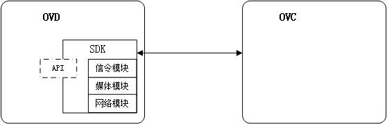

# SDK对外开放API接口说明
## 一、设备端开放SDK集成接口说明
**本文档描述了开放SDK与本地视音频设备之间的交互接口， 通过本说明，本地视音频设备可以通过SDK提供的统一接入能力接入到开放云平台，提供相应的服务及设置。**

   
## 二、接口文档概述
## 1 开放SDK在系统中的位置

## 2 开放SDK流程简述

## 3 开放SDK内容介绍
### 头文件

### 库文件 

## 三、接口详细描述
## 1 SDK初始化
### 接口描述
设备上电后调用
### 接口定义
**`int OVD_Init(void *userData, OVDClientParam clientParam, OVDLogParam logParam, OVD_CallBackFunList callBackFunList)`**

### 参数说明：
    [in]clientParam:       云服务器地址及端口号，见OVDClientParam结构体
	[in]logParam:          输出日志配置信息，见OVDLogParam结构体
    [in]callBackFunList:   提供给服务器端调用的回调函数，以相应服务器端的请求，见OVD_CallBackFunList。   注：若未提供相关的回调函数，则相关请求被丢弃，及设备端不提供对应的功能。
### 返回值：
    成功：0
    失败：其他值

## 2 开启服务
### 接口描述
wifi连接成功后调用，通知SDK网络已经准备好，可以去连接云开放平台
### 接口定义
**`void OVD_SerivceStart(void *userData)`**
### 参数说明：
    无
### 返回值：
    无

## 3 关闭服务
### 接口描述
wifi断线时调用，通知SDK网络异常，停止网络重试等操作
### 接口定义
**`void OVD_SerivceStop(void *userData)`**
### 参数说明：
    无
### 返回值：
    无

## 4 告警接口
### 4.1 告警开始
### 接口描述
设备检测到告警条件，触发告警
### 接口定义
**`int OVD_AlarmInfoStart(void *userData,OVDUpLoadAlarmInfo alarmInfo)`**
### 参数说明：
    [in]alarmInfo:    报警信息结构体，详细可见结构体描述OVDUpLoadAlarmInfo
### 返回值：
    成功：0
    失败：其他值

    
### 4.1 告警结束
### 接口描述
设备告警结束
### 接口定义
**`int OVD_AlarmInfoEnd(void *userData,int channel, OVDAlarmType alarmType,time_t endTimeStamp)`**
### 参数说明：
    [in]channel;        通道号
    [in]alarmType:      告警类型，详细可见枚举OVDAlarmType
	[in]endTimeStamp:   报警结束时间戳
### 返回值：
    成功：0
    失败：其他值

## 5 音视频内容接口
### 5.1 音视频内容准备传送接口
### 接口描述
设备准备好音频、视频或者音视频，开始准备发送
### 接口定义
**`int OVD_AVPushStart(void *userData,int channel,OVDContentType contentType,OVDVideoDataFormat videoinfo,OVDAudioDataFormat audeoinfo)`**
### 参数说明：
    [in]channel:         通道号
    [in]contentType:     准备传送的内容，详见枚举值OVDContentType 音频、视频、音视频
    [in]videoinfo:       视频信息,详见结构体OVDVideoDataFormat，OVDContentType为视频、音视频有效
    [in]audeoinfo:       视频信息,详见结构体OVDAudeoDataFormat，OVDContentType为音频、音视频有效
### 返回值：
    成功：0
    失败：其他值

### 5.2 音视频内容推送接口
### 接口描述
设备向SDK推动音视频内容
### 接口定义
**`int OVD_AVPushData(void *userData,int channel,OVDContentType contentType,char isIFrame,void* contentData,int dataLen,time_t timestamp)`**
### 参数说明：
    [in]channel:         通道号
    [in]contentType:     准备传送的内容，详见枚举值OVDContentType 音频、视频、音视频
    [in]isIFrame:        是否是I帧  0：不是 1：是
    [in]contentData:     发送数据的首字节指针
    [in]videoDataLen:    本次发送数据的长度
    [in]timestamp:       该帧时间戳(ms)
### 返回值：
    成功：0
    失败：其他值

### 5.3 音视频内容传送结束接口
### 接口定义
**`int OVD_AVPushEnd(void *userData,int channel,OVDContentType contentType)`**
### 参数说明：
    [in]channel:         通道号
    [in]contentType:     准备传送的内容，详见枚举值OVDContentType 音频、视频、音视频
### 返回值：
    成功：0
    失败：其他值

### 5.4 音视频参数修改
### 接口描述
已经启动音视频传送后，若设备的音视频参数修改，则调用此接口通知sdk变动的参数
### 接口定义
**`int OVD_AVParamModify(void *userData,int channel,OVDContentType contentType,OVDVideoDataFormat videoinfo,OVDAudioDataFormat audeoinfo)`**
### 参数说明：
    [in]channel:         通道号
    [in]contentType:     准备传送的内容，详见枚举值OVDContentType 音频、视频、音视频
    [in]videoinfo:       视频信息,详见结构体OVDVideoDataFormat，OVDContentType为视频、音视频有效
    [in]audeoinfo:       视频信息,详见结构体OVDAudeoDataFormat，OVDContentType为音频、音视频有效
### 返回值：
    成功：0
    失败：其他值

## 6 SD卡录像内容回放推送接口
### 接口描述
APP打开相关录像文件后，设备推送相关内容
*录像内容查询、打开录像文件、录像文件控制、录像删除等功能，由回调函数定义，详见（SDK初始化）的参数定义*
### 接口定义
**`int OVD_SendRecordAVContent(void *userData,int channel,OVDContentType contentType,char isIFrame,char isIFrame,void* contentData,int videoDataLen,time_t timestamp)`**
### 参数说明：
    [in]channel:         通道号
    [in]contentType:     准备传送的内容，详见枚举值OVDContentType 音频、视频、音视频
    [in]isIFrame:        是否是I帧  0：不是 1：是
    [in]contentData:     发送数据的首字节指针
    [in]videoDataLen:    本次发送数据的长度
    [in]timestamp:       该帧时间戳(ms)
### 返回值：
    成功：0
    失败：其他值

## 7 声波配置网络接口
### 7.1 声波初始化
### 接口描述
设备检测到无网络配置信息，判断若使用声波配网，则调用此接口，传入声波参数
### 接口定义
**`void* OVD_SoundWaveInit(int sampleRate,int bitWidth)`**
### 参数说明：
    [in]sampleRate:      采样率
    [in]bitWidth:        位宽(8/16bit)
### 返回值：
    成功：返回声波句柄
    失败：NULL

### 7.2 开始声波识别
### 接口描述
设备开始声波配网后，获取到音频文件，发送到SDK识别；SDK识别完后，调用回调end_cbfunc返回配网信息
### 接口定义
**`int OVD_SoundWaveStart(void *recognizer,RecognizStart start_cbfunc,RecognizEnd end_cbfunc)`**
### 参数说明：
    [in]recognizer:      声波句柄
    [in]start_cbfunc:    识别开始回调函数，定义为 typedef void (*RecognizStart)(void);
    [in]end_cbfunc:      识别结束回调函数（此函数返回wifi信息）；回调函数定义为 void (*RecognizEnd)(struct OVDWiFiInfo info);
### 返回值：
    成功：0
    失败：其他值

### 7.3 采集到的声波数据，写入识别器
### 接口描述
设备开始声波配网后，把声波数据传入SDK的识别器
### 接口定义
**`int OVD_SoundWaveWriteData(void *recognizer,const void *data,unsigned long len)`**
### 参数说明：
    [in]recognizer:      声波句柄
    [in]data:            声波数据的首字节指针
    [in]len:             声波数据长度
### 返回值：
    成功：成功写入的数据长度
    失败：小于0的值

### 7.4 停止声波识别
### 接口描述
识别完后，调用此接口
### 接口定义
**`int OVD_SoundWaveStop(void *recognizer)`**
### 参数说明：
    [in]recognizer:      声波句柄
### 返回值：
    成功：0
    失败：其他值

## 8 门锁端特殊接口
### 7.1 上报门锁操作消息(开锁/增删用户/系统锁定/系统恢复出厂设置等等)
### 接口定义
**`int OVD_LockUploadMsgInfo(void *userData,OVDLockMsgInfo lockinfo)`**
### 参数说明：
    [in]lockinfo:        锁端消息信息,详细可见结构体描述OVDLockMsgInfo
### 返回值：
    成功：0
    失败：其他值

## 9 回调OVD_CallBackFunList定义及说明
### 9.1 回调结构体定义
    typedef struct{
        //获取设备信息，开放平台获取设备的固有信息
		/*
        **参数说明:
        **    [out]deviceInfo:    需要设备返回的信息，详细见结构体OVDDeviceInfo
        **    
        **返回值：
        **    成功：0
        **    失败：其他值
        */
        int (*OVD_GetOVDDeviceInfo)(void *userData,OVDDeviceInfo *deviceInfo);        

        //设备端信息获取接口，开放平台获取设备的配置信息
		/*
        **参数说明:
        **    [out]configureInfo:    需要返回的信息，其中没有的项置为NULL，详细可见结构体描述OVDConfigrationInfo
        **    
        **返回值：
        **    成功：0
        **    失败：其他值
        */
        int (*OVD_GetOVDConfigureInfo)(void *userData,OVDConfigrationInfo *configureInfo);

        //配置设备端信息接口，开放平台设置设备的配置信息
		/*
        **参数说明:
        **    [in]configureSetter:    需要设置的信息，详细可见结构体描述OVDConfigrationInfo
        **    
        **返回值：
        **    成功：0
        **    失败：其他值
        */
        int (*OVC_SetOVDConfigureInfo)(void *userData,OVDConfigrationInfo configureSetter);

        //重启channel，通过此接口去重启特定的channel。注：如设备不支持单独重启channel，则直接重启设备。
        /*
        **参数说明:
        **    [in]channel:           若重启channel，则为需要重启的channel。 注：如设备不支持单独重启channel，则直接重启设备。
        **    
        **返回值：
        **    成功：0
        **    失败：其他值
        */
        int (*OVD_ReBootChannel)(void *userData,int channel);

        //重启设备，通过此接口去重启设备。
        /*
        **参数说明:
        **    无
        **    
        **返回值：
        **    成功：0
        **    失败：其他值
        */
        int (*OVD_ReBootDevice)(void *userData);

        //恢复配置到出厂状态
        /*
        **参数说明:
        **    [in]iskeepNetConfigre:    是否保留wifi的网络配置，0:保留， 1:不保留
        **    
        **返回值：
        **    成功：0
        **    失败：其他值
        */
        int (*OVD_ResetConfiguration)(void *userData,char iskeepNetConfigre);

        //按页查询录像文件
        /*
        **参数说明:
        **    [in]channel:        通道号
        **    [in]recordType:     文件类型（0：视频文件 1：告警文件）
        **    [in]startStamp:     录像查询的起始时间戳(s)
        **    [in]endStamp:       录像查询的结束时间戳(s)
        **    [in]page:           查询的页码
        **    [in]numInPage:      每页的条数
        **    [in]fileInPage:     录像文件列表信息，详细可见结构体描述OVDRecordFileListPerPage
        **
        **返回值：
        **    成功：0
        **    失败：其他值
        **
        **其他说明:
        **    假设查询的录像文件数有200个，numInPage=10，则最大页码Page为20。若传进的参数numInPage=10，page=2，则fileInPage应该返回第10个到第20个录像的信息;若传进的参数numInPage=10，page=21，则fileInPage返回空录像信息(录像个数为0)                     
        */
        int (*OVD_QueryRecordPage)(void *userData,int channel,int recordType,time_t StartStamp,time_t EndStamp,int Page,int PageNum,OVDRecordFileListPerPage *FilePage);

        //打开录像文件
        /*
        **参数说明:
        **    [in]channel:          通道号
        **    [in]recordname:       录像文件名称
        **    [out]videoInfo:       视频信息,详细可见结构体描述OVDVideoDataFormat
        **    [out]audioInfo:       音频信息,详细可见结构体描述OVDAudioDataFormat
        **    [out]fileTotalTime:   该录像的时长(ms)
        **    
        **返回值：
        **    成功：0
        **    失败：其他值
        */
        int (*OVD_OpenRecordFile)(void *userData,int channel,char* recordname,OVDVideoDataFormat* videoInfo,OVDAudioDataFormat* audioInfo,int* fileTotalTime);

        //录像文件控制
        /*
        **参数说明:
        **    [in]channel:         通道号
        **    [in]controlType:     播放控制，详细可见枚举类型OVDCONTROLTYPE
        **    [in]value:           额外值，目前只有视频拖动时会用到，代表要跳至的视频时间戳(ms)
        **    
        **返回值：
        **    成功：0
        **    失败：其他值
        */
        int (*OVD_RecordCotrol)(void *userData,int channel,OVDCONTROLTYPE controlType,int value);

        //录像文件删除
        /*
        **参数说明:
        **    [in]recordname:      待删除的录像名称
        **    
        **返回值：
        **    成功：0
        **    失败：其他值
        */
        int (*OVD_RecordFileDelete)(void *userData,char* recordname);

        //设备升级接口，开放平台上传新的升级包，制定升级策略后，调用此接口通知设备进行版本升级。由设备根据提供的URL去下载升级包升级
        /*
        **参数说明:
        **    [in]firmware_model:  要升级的固件的版本号
        **    [in]upgradeURL:      升级固件的远程url，由设备主动去下载、升级
        **    
        **返回值：
        **    成功：0
        **    失败：其他值
        */
        int (*OVD_FirmwareUpgrade)(void *userData,char *firmware_model, char *upgradeURL);

        //设备升级状态查询，开放平台上在下发固件升级后，会不定期的查询升级状态及进度。设备通过此接口返回当前的升级状态及进度
        /*
        **参数说明:
        **    [in]firmware_model:    要查询的目标升级版本号
        **    [out]upgradeStatus:    升级状态，详细见枚举值OVDUpgradeStatus
        **    [out]upgradeProgress:  升级进度，整数值 0-100
        **    
        **返回值：
        **    成功：0
        **    失败：其他值
        */
        int (*OVD_QueryFirmwareUpgradeStatus)(void *userData,char *firmware_model, OVDUpgradeStatus *upgradeStatus, int *upgradeProgress);

        //设备时间同步，由开放平台发起时间同步；由于网络延迟，若设备上的原有时间与服务器同步的时间的偏差在offset秒之内，则设备无需同步时间
        /*
        **参数说明:
        **    [in]time:             要同步的时间，为字符串，格式yyyy-MM-ddTHH:mm:ss，例子：2016-12-05T02:15:32
        **    [in]offset:           为整数，单位秒。由于网络延迟，设置此为可接受的偏差，若设备原时间与上面给定的时间的偏差在offset秒之内，则设备无需同步时间
        **    
        **返回值：
        **    成功：0
        **    失败：其他值
        */
        int (*OVD_SyncTime)(void *userData,char *time, int offset);        

        //设备时间查询，查询设备上当前的时间
        /*
        **参数说明:
        **    [out]time:             设备上的时间，为字符串，格式yyyy-MM-ddTHH:mm:ss，例子：2016-12-05T02:15:32
        **    
        **返回值：
        **    成功：0
        **    失败：其他值
        */
        int (*OVD_QueryTime)(void *userData,char *time);  

        //获取SD卡信息
        /*
        **参数说明:
        **    [out]sdInfo:   存储卡信息,详细可见结构体描述OVDSDInfo
        **    
        **返回值：
        **    成功：0
        **    失败：其他值
        */
        int (*OVD_GetSDInfo)(void *userData,OVDSDInfo *sdInfo);

        //格式化SD卡
        /*
        **参数说明:
        **    无
        **    
        **返回值：
        **    成功：0
        **    失败：其他值
        */
        int (*OVD_SetSDCardFormat)(void *userData);       

        //云台控制设备，控制设备转动，携带转动速度。注：若设备不支持，则可忽略speed值
        /*
        **参数说明:
        **    [in]channel:         通道号
        **    [in]ptzcmd:          控制命令,详细可见枚举类型OVCPTZControlCmd
        **    [in]speed:           表示转动速度，整数，0-100，0最慢，100最快，默认100。 注：若设备不支持，则可忽略此参数值
        **    
        **返回值：
        **    成功：0
        **    失败：其他值
        */
        int (*OVD_PTZCmd)(void *userData,int channel,OVCPTZControlCmd ptzcmd,int speed);

        //获取设备预置点列表信息
        /*
        **参数说明:
        **    [in]channel:         通道号
        **    [out]presetList:     返回的预置点列表
        **    [out]count:          预置点个数
        **    
        **返回值：
        **    成功：0
        **    失败：其他值
        */
        int (*OVD_GetPresetList)(void *userData,int channel,int *presetList, int *count);

        //打开对讲接口，准备与APP对讲
        /*
        **参数说明:
        **    [in]channel:         通道号
        **    [in]encordType:      编码类型,详细可见枚举类型OVDAUDIOPLY_TYPE
        **    [in]sampleRate:      采样率
        **    [in]bitWidth:        位宽(8/16bit)
        **    [in]volume:          声音大小(0-100)
        **    [in]priority:        优先级(越大越高，多个事务占用音频需要考虑此参数)
        **    
        **返回值：
        **    成功：0
        **    失败：其他值
        */
        int (*OVD_AudioPlayStart)(void *userData,int channel,OVDAUDIOPLY_TYPE encordType,int sampleRate,int bitWidth,int volume,int priority);

        //播放对讲音频，SDK收到APP端的音频数据后，通知设备端播放
        /*
        **参数说明:
        **    [in]channel:   通道号
        **    [in]buf:      音频数据指针
        **    [in]size:     音频数据大小
        **    
        **返回值：
        **    成功：0
        **    失败：其他值f
        */
        int (*OVD_AudioPlayProGress)(void *userData,int channel,char* buf, int size);

        //关闭对讲接口，APP端对讲结束，或者一段时间内SDK未收到APP端的数据，则调用此接口
        /*
        **参数说明:
        **    [in]channel:         通道号
        **    
        **返回值：
        **    成功：0
        **    失败：其他值
        */
        int (*OVD_AudioPlayStop)(void *userData,int channel);

        //强制出I帧，通知视频强制出一个I帧
        /*
        **参数说明:
        **    [in]channel:         通道号
        **    
        **返回值：
        **    成功：0
        **    失败：其他值
        */
        int (*OVD_ForceIFrame)(void *userData,int channel);

        //截图，截取当前的视频画面
        /*
        **参数说明:
        **    [in]channel:         通道号
        **    [out]ImageInfo;	   截取的图片信息
        **    
        **返回值：
        **    成功：0
        **    失败：其他值
        */
        int (*OVD_Snapshot)(void *userData,int channel,OVDImageInfo *imageInfo);

        //音乐播放，服务器端给定播放的url，有设备去下载歌曲并播放
        /*
        **参数说明:
        **    [in]channel:         通道号
        **    [in]url:          歌曲下载的url
        **    [in]priority:     优先级(越大越高，多个事务占用音频需要考虑此参数)
        **    
        **返回值：
        **    成功：0
        **    失败：其他值
        */
        int (*OVD_SetMp3Url)(void *userData,int channel,char url[1024],int priority);

        //音乐播放控制，服务器端控制音乐播放 停止、暂停、继续。
        /*
        **参数说明:
        **    [in]channel:      通道号
        **    [in]ctrl:         播放控制,详细可见枚举类型OVDMp3PlayCtrl
        **    
        **返回值：
        **    成功：0
        **    失败：其他值
        */
        int (*OVD_Mp3PlayCtrl)(void *userData,int channel,OVDMp3PlayCtrl ctrl);

        //获取音乐播放状态，当前正在播放的音乐文件的URL，该域不存在或者空串表示当前未播放
        /*
        **参数说明:
        **    [in]channel:         通道号
        **    [out]url:            正在播放的歌曲的下载url，该域不存在或者空串表示当前未播放
        **    
        **返回值：
        **    成功：0
        **    失败：其他值
        */
        int (*OVD_GetMp3PlayStatus)(void *userData,int channel,char url[1024]);

        //设置门锁端的时间
        /*
        **参数说明:
        **    [in]timeInfo:         设置时间,详细可见结构体描述OVDDateTime
        **    
        **返回值：
        **    成功：0
        **    失败：其他值
        */
        int (*OVD_SetLockTime)(void *userData,OVDDateTime timeInfo);

        //获取门锁端的时间
        /*
        **参数说明:
        **    [out]timeInfo:         获取锁端时间,详细可见结构体描述OVDDateTime
        **    
        **返回值：
        **    成功：0
        **    失败：其他值
        */
        int (*OVD_GetLockTime)(void *userData,OVDDateTime *timeInfo);

    }OVD_CallBackFunList;

## 10 附加定义及说明
    typedef enum
	{
		OVD_Audio	=	0,          //音频
		OVD_Video   =	1,          //视频
		OVD_Video_Audio   =	2,      //音视频
	}OVDContentType;

	typedef enum
	{
		OVD_1DMODE  =   0, //低清
		OVD_SDMODE  =   1, //标清
		OVD_HDMODE  =   3, //高清
		OVD_FHDMODE  =  4, //全高清
	}OVDEncodeQuality;

	typedef struct
	{
		char*          codec;			//编码方式，目前仅支持H264，其他不支持，必填
		OVDEncodeQuality  quality;         //图像质量，必填
		int            frameRate;		//帧率, fps，可选，负值表示未知
		int            bitRate;		    //码流比特率, 可选，负值表示未知
		int            width;			//图像宽度，可选，负值表示未知
		int            height;			//图像高度，可选，负值表示未知
		int            gop;		        //每秒多少帧，可选，负值表示未知
	}OVDVideoDataFormat;

	typedef struct
	{
		char*          codec;			//编码方式，目前仅支持acc，其他不支持，必填
		int            samplesRate;		//采样率，可选，负值表示未知
		int            bitRate;		    //码流比特率, 可选，负值表示未知
		int            bitPerSample;	//位宽，即每个sample的比特数, 可选，负值表示未知
		int            samplePerFrame;	//每帧的采样数, 可选，负值表示未知
		int            channelNumber;	//音频声道数, 可选，负值表示未知
	}OVDAudioDataFormat;

	typedef struct{
		bool isEffect;                  //是否具备此能力，若设备无此能力，置为false
		bool on;                        //是否打开此功能，在isEffect为true时有效
		int  sensitivity;               //探测灵敏度，范围为0-100，在isEffect为true时有效
	}OVDAlarmInfo;

	typedef struct{
		OVDAlarmInfo   ioAlarm;              //外部报警配置，必填
		OVDAlarmInfo   faceAlarm;            //人脸识别配置，必填
		OVDAlarmInfo   cryAlarm;             //哭声侦测配置，必填
		OVDAlarmInfo   voiceAlarm;           //声音侦测配置，必填
		OVDAlarmInfo   motionAlarm;          //移动侦测配置，必填
		OVDAlarmInfo   crossAlarm;           //拌网配置，必填
	}OVDAlarmsSet;

	typedef struct
	{
		bool horflip;              //水平翻转，true表示翻转，false表示正常,必填,
		bool verflip;              //垂直翻转，true表示翻转，false表示正常,必填,
	}OVDMirrorFlip;

	typedef struct{
		int channel;                //通道号， 必填
		OVDVideoDataFormat videoinfo; 	//视频信息,必填,详细可见结构体OVDVideoDataFormat
		OVDAudioDataFormat audioinfo; 	//视频信息,必填,详细可见结构体OVDAudioDataFormat
		OVDMirrorFlip         flipInfo;    //图像翻转信息，必填,详见结构体OVDMirrorFlip
		OVDAlarmsSet          alarms;      //各种告警设置信息，必填,详见结构体OVDAlarmsSet
		int                audioOutValume;  //扬声器输出音量，可选，0-100为正常值。小于0为不支持
		bool               traceAbility;    //移动跟踪，可选，true支持跟踪，false不支持跟踪
	}OVDChannelsInfo;

	typedef struct
	{
        int               channelsInfoCount;   //指示有多少个channelsInfo
        OVDChannelsInfo   *channelsInfo;       //channel告警列表
		int               tz;                  //时区信息，必填，例如东八区为8
	}OVDConfigrationInfo;

	typedef struct
	{
		char devId[32];                 //设备ID号，必填
		char hardwareModel[32];         //设备型号，必填
		char firmware_model[32];        //设备固件版本号，必填
		char wifi_ssid[48];             //设备当前连接的wifi的ssid, 该字段空串表示未连接wifi，可选
		int  wifi_signal;               //设备当前wifi的信号强度, 0-100, 当wifi_ssid不为空时有效，可选
		int  upBandwidth;               //设备探测到的上行最大带宽，单位bps，不存在则表示上行带宽未知，负值表示未知，可选
		int  downBandwidth;             //设备探测到的下行最大带宽，单位bps，不存在则表示下行带宽未知，负值表示未知，可选
		char ipAddr[128];               //IP地址    <局域网IP，支持IPV6>，空值表示未知，可选
		char macAddr[24]; 	            //MAC地址，空值表示未知，可选
	}OVDDeviceInfo;

	typedef struct
	{
		char passDomain[128];        //<云服务器的域名>，必填
		int  passPort;       //<云服务器的端口>，必填
		char p2p_passDomain[128];    // <P2P pass 的域名>，必填
		int  p2p_passPort;   //<杭研p2p pass的端口>，必填
		char turnDomain[128];        //<P2P turn的域名>，没有置为空
		int  turnPort;       //<p2p turn 的端口>，没有置为-1
		char hibernationDomain[128];        //<休眠服务地址域名>，没有置为空
		int  hibernationPort;       //<休眠服务地址端口>，没有置为-1
	}OVDNetParam;

	typedef emum
	{
		DevType_Gun  = 1,         //枪机
		DevType_Nvr  = 2,
		DevType_Card  = 4,        //卡片机
		DevType_Shake = 5,        //摇头机
		DevType_NewCard = 6,
		DevType_Battery = 7,
		DevType_4G   = 8,
		DevType_NewShake= 9,      //新摇头机 (16k全双工)
		DevType_NewGun = 10,      //为G3S2新加
		DevType_FaceRcgn= 11,     //人脸识别Q1
		DevType_BatSingle = 12,   //电池单品
		DevType_FamilyBall = 13,
		DevType_LockI9M    = 14,
		DevType_PtzCamera= 15,     //球机
		DevType_Other,
	}OVDDEVType;

	typedef struct
	{
		OVDDEVType devType;            //设备类型，详细可见枚举类型OVDDevType，必填
		char OVDDeviceID[32];           //OVD设备ID，必填
		char OVDPassword[64];           //OVD接入密码，必填
		char OVDDevType[64];            //OVD的硬件型号，必填
		char OVDSystemVersion[64];      //OVD的固件版本号，必填
		int  period;                    //device记录的SDK周期上报的周期，单位：秒，必填
		OVDNetParam netParam;           //网络信息，必填
	}OVDClientParam;

	//日志输出基本依次增高
	typedef enum{
		OVD_LOGLEVEL_TRACE = 0,
		OVD_LOGLEVEL_DEBUG = 1,
		OVD_LOGLEVEL_INFO  = 2,
		OVD_LOGLEVEL_WARN  = 3,
		OVD_LOGLEVEL_ERROR = 4,
		OVD_LOGLEVEL_FATAL = 5,
	}OVDLogLevel;

	//日志输出位置
	typedef enum{
		OVD_LOGSTD_OUT = 0,  //标准输出
		OVD_LOGSTD_ERR = 1,  //标准异常
		OVD_LOGSTD_NO  = 2,  //不输出
	}OVDLogSTD;

	typedef struct
	{
		OVDLogLevel logLevel;           //日志输出级别，详细见枚举值LogLevel，可选
		OVDLogSTD   logSTD;             //日志输出位置，可选，详细见枚举值LogSTD，可选
		void (*pOVDLogOutCallBack)(char *outBuff);  //device提供的日志输出回调，SDK的输出日志可以保存到device的存储文件中，可选，空为不支持
	}OVDLogParam;

	typedef enum
	{
		OVD_STATUS_IDLE	          =	  0,  //空闲胎
		OVD_STATUS_DOWNLOADING	  =	  1,  //安装包下载中
		OVD_STATUS_DOWNLOADED     =   2,  //安装包下载完成
		OVD_STATUS_WAIT_INSTALL   =   3,  //等待安装
		OVD_STATUS_INSTALLING     =   4,  //安装中
		OVD_STATUS_INSTALLED      =   5,  //已安装完毕
		OVD_STATUS_FAILED         =   6,  //安装失败
		OVD_STATUS_BUSY           =   7,  //系统忙
	}OVDUpgradeStatus;

	typedef struct
	{
		char FileName[1024];
		int  FileTypeMask; 				//文件类型
		time_t FileStartStamp;		    //录像开始时间
		time_t FileEndStamp;			//录像接收时间
		int  RecordDuration; 			//时长
		int  FileSize; 					//文件大小
	}OVDRecordFileInfo;

	typedef struct
	{
		int               fileCount;            //文件数量
		OVDRecordFileInfo fileinfo[100];        //文件列表
	}OVDRecordFileListPerPage;

	typedef enum
	{
		OVD_CONTINUE	=	0,  //继续播放
		OVD_PAUSE	    =	1,  //暂停
		OVD_STOP        =   2,  //停止
		OVD_FAST        =   3,  //快进
		OVD_SLOW        =   4,  //慢放
		OVD_JUMP        =   5,  //拖动  ms
	}OVDCONTROLTYPE;

	typedef struct
	{
		int  SDExist;		    //0 not or 1 yes;
		int	 SDTotalSize;	    //总容量(M)
		int	 SDFreeSize;	    //空闲量
		char EarlyFileName[64]; //当前SD卡最早一个录像文件
	}OVDSDInfo;

	typedef enum
	{
		OVC_PTZ_MV_UP        = 0,   //向上
		OVC_PTZ_MV_DOWN      = 1,   //向下
		OVC_PTZ_MV_LEFT      = 2,   //向左
		OVC_PTZ_MV_RIGHT     = 3,   //向右
		OVC_PTZ_MV_UPLEFT    = 4,   //左上
		OVC_PTZ_MV_UPRIGHT   = 5,   //右上
		OVC_PTZ_MV_DOWNLEFT  = 6,   //左下
		OVC_PTZ_MV_DOWNRIGHT = 7,   //右下
		OVC_PTZ_ZOOM_IN      = 8,   //拉近
		OVC_PTZ_ZOOM_OUT     = 9,   //拉远
		OVC_PTZ_MV_STOP      = 10,    //停止运动
		OVC_PTZ_GOTO_PRESET  = 11,   //跳转预置位
		OVC_PTZ_SET_PRESET   = 12,   //设置预置位点
		OVC_PTZ_CLEAR_PRESET = 13,   //清除预置位点
	}OVCPTZControlCmd;

	typedef enum{
		PCM          = 0,
	}OVDAUDIOPLY_TYPE;

	typedef enum
	{
		MP3_CLOSE	=	0,  	 //停止播放
		MP3_PAUSE	=	1,  	 //暂停播放
		MP3_RESUME	= 	2,    //恢复播放
		MP3_OTHER,
	}OVDMp3PlayCtrl;

	typedef struct
	{
		char *buf;    			//数据buf
		int  size;    			//数据长度
		//char		  ImageUrl[1024];	//目前没用到,可填空
	}OVDImageInfo;

	typedef enum
	{
		OVD_OUTTER  =   1,      //外部告警
		OVD_MOTIOM	= 	2,      //移动侦测
		OVD_CROSS	= 	3,      //拌网侦测
		OVD_CRY		=	4,      //哭声侦测
		OVD_FACE	=	5,      //脸部识别
		OVD_VOICE	=	6,      //声音侦测
		OVD_OTHER,
	}OVDAlarmType;

	typedef struct
	{
		int        channel;            //通道号
		time_t     startTimeStamp;	   //报警开始时间戳
		OVDAlarmType	AlarmType;     //报警类型
		char*      desc;               //告警描述
		OVDImageInfo	ImageInfo;	   //背景图信息
	}OVDUpLoadAlarmInfo;

	typedef enum {
		OVD_LOCK_OPEN		=	0,	   //开锁事件
		OVD_LOCK_PICKALARM	=	1,	   //撬锁事件
		OVD_LOCK_ADDUSER	=	2,	   //添加用户事件
		OVD_LOCK_DELUSER	=	3,  //删除用户事件
		OVD_LOCK_DOORBELL	= 	4,	   //门铃事件
		OVD_LOCK_SYSTEMLOCK	=	5,	   //系统锁定事件(例如:连续输错5次密码会自动锁定)
		OVD_LOCK_LOWBAT		=	6,	   //低电报警
		OVD_LOCK_RESET		=	7,	   //恢复出厂设置报警
	}OVDLockMsgType;

	typedef struct
	{
		int 		m_year;			    //年,2009
		int		m_month;		    //月,1-12
		int		m_day;			    //日,1-31
		int		m_hour;			    //0-24
		int		m_minute;		    //0-59
		int		m_second;		    //0-59
		int		m_microsecond;	    //毫秒	0-1000
	}OVDDateTime;

	typedef enum
	{
		LOCK_KEY		=	0x00,  //钥匙开锁
		LOCK_PSW		=	0x01,  //密码开锁
		LOCK_FINGER		=	0x02,  //指纹开锁
		LOCK_CARD		=	0x03,  //门卡开锁
		LOCK_REMOTE		=	0x04,  //遥控开锁
		LOCK_PICK		=	0x05,  //撬锁
		LOCK_TEMPPSW	=	0x06,  //临时密码开锁
		LOCK_OTHER,
	}OVDUnlockType;

	typedef struct
	{
		char			Name[128]; 		   //开锁用户名称
		OVDDateTime		UnlockTime;		   //开锁时间
		OVDUnlockType	UnlockType;		   //开锁类型
		int      		UserNumber;		   //开锁用户编号
	}OVDLockOpenInfo;

	typedef struct
	{
		OVDUnlockType	 UnlockType;		//对应用户录入的开锁类型
		int     		 UserNumber;		//对应用户录入的用户编号
	}OVDLockUserInfo;

	typedef struct{
		OVDLockMsgType	msgType;			//消息类型

		//msgType 为 OVD_LOCK_OPEN 才起作用
		OVDLockOpenInfo	openInfo;			//开锁信息

		//msgType 为 OVD_LOCK_ADDUSER 或者 OVD_LOCK_DELUSER 才起作用
		OVDLockUserInfo	userInfo;			//添加/删除用户的详细信息

		//msgType 为 OVD_LOCK_LOWBAT 才起作用
		int   			Electric;			//低电报警时附带的电量 1~100
	}OVDLockMsgInfo;

	typedef struct
	{
		char ssid[64];   //wifi的ssid
		int  ssidLen;
		char pwd[80];    //wifi密码
		int  pwdLen;
	}OVDWiFiInfo;
