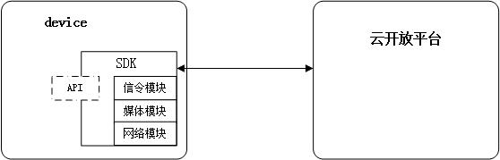
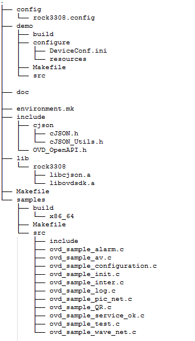
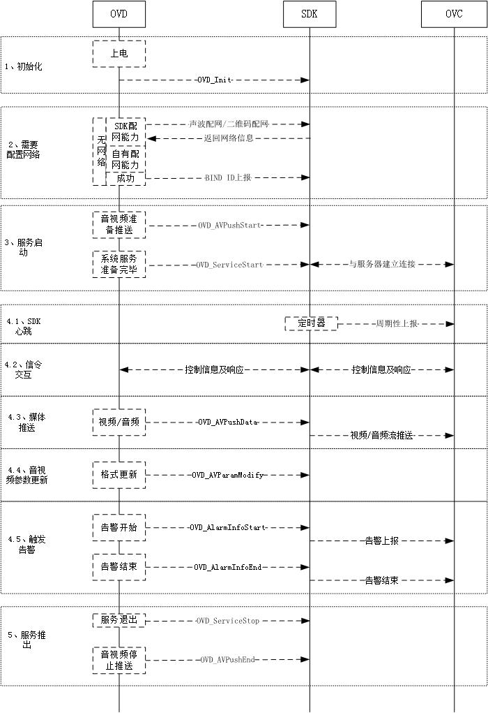
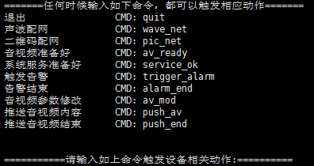

# SDK使用说明
**本文档描述了开放SDK的结构及集成方法，通过本说明，可以了解开放SDK的使用集成方法，可以使用模拟的demo和sample程序了解SDK的集成及使用方法、流程等。**

**名词解释**

- OVS：open video system，开放视频云，一种基于物联网云计算技术的视频云系统；
  与传统NVR，DVR类似，OVS可以接入和管理各种带视频功能设备，支持直播、录像、点播、P2P实时通信等功能，
  但是与传统NVR，DVR的不同在于用户可以在互联网上观看视频，
  并且因为应用了云计算技术，OVS拥有近于无限的接入能力以及海量的并发直播点播请求；OVS主要由OVC与OVD两部分组成。

- OVC：open video cloud，运行在云端的开放视频云平台；
  提供API接口以及管理网页，用户可以随时通过互联网，以网页、APP、公众号、小程序等方式接入OVC，对其下属的摄像头进行管理，并进行直播点播。

- OVD：open video device, 开放视频设备，安装在客户现场的，具有与OVC通信能力的视频设备，如摄像头，门铃，音箱等，OVD通过“开放协议”接入OVC，并接受OVC的管理。

- Channel：OVD上的视频通道；
  一般一路摄像头为一条channel。如果OVD为摄像头，则只有一条通道，且通道号必须为0；
  如果IVT为NVR/DVR，则会有多条通道，每条通道代表一个NVR管理下的摄像头。

## 一、 SDK在系统中的位置

## 二、SDK目录及说明
### 1、目录架构
	SDK目录架构如下：

### 2、目录说明
#### 2.1 config目录
    功能：主要配置编译连接时的参数

	config目录里包含XXX(设备型号标识).config , 在这个config文件内容参考如下：
	#############moudule（libovd.a 包含的子模块情况)#########################
	CONFIG_MODULE_helloworld=y
	CONFIG_MODULE_libwebsocket=y
	CONFIG_MODULE_cJSON=y
	CONFIG_MODULE_DME=y
	CONFIG_MODULE_OPENAPI=y
	CONFIG_MODULE_log=y
	CONFIG_MODULE_HTTPCLIENT=y
	CONFIG_MODULE_P2P=y
	CONFIG_MODULE_wave=y
	CONFIG_MODULE_zbar=y
	CONFIG_MODULE_stream=y
	CONFIG_MODULE_picupload=y
	###########sdk(当前libovd.a (SDK) 的版本)################################
	CONFIG_SDK_VERSION=V1.0.0
	
	#############################################(当前辅助编译开关和调试开关)
	CONFIG_BUILD_SDK_WHOLE=y
	CONFIG_DEBUG_MODE=y
	
	###########environment####################
	CONFIG_CUSTOM_NAME=rock3308 (设备标志字符串)
	CONFIG_EXTERNAL_TOOL_CHAIN=y (是否用非系统默认gcc)
	TOOLCHAIN_BIN_PATH=/opt/ovd_toolchain/rockchip-3308/prebuilts/gcc/linux-x86/aarch64/gcc-linaro-6.3.1-2017.05-x86_64_aarch64-linux-gnu/bin (交叉工具链gcc的二进制路径)
	CROSS_COMPILE=aarch64-linux-gnu-   (交叉工具链gcc前缀)
	CROSS_SYSROOT=/opt/ovd_toolchain/rockchip-3308/prebuilts/gcc/linux-x86/aarch64/gcc-linaro-6.3.1-2017.05-x86_64_aarch64-linux-gnu/aarch64-linux-gnu/libc (交叉工具链的逻辑库地址)
	CUSTOM_CFLAGS=                   (厂商设备需特定的编译参数)
	
	若厂商已配置好自己的交叉工具链GCC环境，例如默认gcc 直接指向 交叉工具链，则厂商只需将CONFIG_EXTERNAL_TOOL_CHAIN=N 即可，不需指定TOOLCHAIN_BIN_PATH, CROSS_COMPILE, CROSS_SYSROOT 这3个参数，否则
	厂商需将CONFIG_EXTERNAL_TOOL_CHAIN=y, 然后根据自己的编译环境来配置TOOLCHAIN_BIN_PATH，CROSS_COMPILE，CROSS_SYSROOT
	
	CUSTOM_CFLAGS 是设备特定的编译参数，由厂商提供和填入。

#### 2.2 environment.mk 和 Makefile 文件
	sdk主目录上的主Makefile

#### 2.3 include目录
	放置sdk对外提供的头文件
	OVD_OpenAPI.h：SDK对外提供的接口文件

#### 2.4 lib目录
	放置sdk对外提供的静态库libovd.a和libcjson.a

	libovd.a: SDK主要对外提供的接口实现
	libcjson.a: SDK提供的json库
	注：libcjson.a 提供了通用json接口实现，若厂商自带有cjson库，后期移植时可自行斟酌是否引用SDK提供的libcjson.a
	 
#### 2.5 doc目录
	sdk对外提供的文档

#### 2.6 demo目录
	功能：demo模块执行文件将模拟为一个设备，可进行注册、配网、推流、告警等一整套流程。

	src:   放置demo 源码文件, 演示和配置文件
	Makefile: demo 模块的 Makefile
	build: 放置demo模块编译生成文件
    configure： 放置设备参数信息。其中DeviceConf.ini为设备参数配置文件，包括了各resource文件的路径配置项，比如模拟的音视频源、告警图片、声波/二维码配网的源信息等。在使用demo时，若有resource文件需要替换，需要替换DeviceConf.ini文件配置项。 
    例如示例中DeviceConf.ini配置资源文件的路径为：
			- resource/video.h264 为模拟摄像头的视频源文件，必须为H264编码。
			- resource/audio.aac  为模拟麦克的音频源文件，必须为AAC格式。
			- resource/alarmPic.bmp 为模拟告警时上传的告警图片
			- resource/snapshotPic.bmp 为OVC下发截图命令时，设备的截图源文件
			- resource/voiceRecognize.pcm 为声波识别时模拟的麦克采集的声波源文件
			- resource/qr.bmp   为二维码识别时模拟的摄像头采集的二维码源文件
             
	
#### 2.7 samples目录
	功能：samples模块为各自流程的模拟程序，每个子程序可独立执行。提供集成参考。

	include, src： 放置sample模块的源文件和头文件
	Makefile:  samples模块的Makefile
	configure,resources:  演示和配置文件
	build: 放置sample模块编译生成文件
	
	sample模块提供几个情景下的sample实例：
		1.sample_init   演示sdk初始化动作
		2.sample_pic_net 演示sdk 二维码识别配网动作
		3.sample_wave_net 演示sdk 声波配网动作
		4.sample_service_ok 演示sdk 连接云服务器
		5.sample_configuration 演示sdk连接云服务器并进行简单的报文交互
		6.sample_alarm 演示sdk基础告警流程
		7.sample_av 演示sdk基础推流流程

## 二、接口使用流程说明
### 1 SDK接入的调用流程图（请关注流程图后的注意事项）
   
### 2 接入流程注意事项
   
- 建议设备按照流程图的步骤1、2、3、4、5进行接口调用，其中步骤4各子流程可以并行执行。
- 设备上电初始化后，若还未配置网络，则调用SDK提供的 *声波配网* 或者 *二维码配网* 方法进行配网；设备有自由配网方式，可以忽略SDK的方法。
- 若设备需要配网，且在设备在配网成功后，根据获取到的网络配置信息，调用SDK的方法OVD_DeviceBindInfo上报BIND ID。
- 若前期已经配网成功，建议在网络连接成功后，再调用步骤3，否则SDK连接服务器失败。
- 建议**保持步骤3的顺序**，因为启动服务后，服务器端可能会立即获取音视频参数，但设备还未上报音视频参数，导致服务器端异常重试，影响体验。
- 音视频准备推送、音视频停止推送可以在SDK运行过程中，根据OVD情况随时调用。但是在步骤3和步骤5建议保持流程图中的推荐调用方式。

   
## 三、SDK接入集成方法
	1. 拷贝头文件到工程目录下，并在代码中引入OVD_OpenApi.h头文件
	2. 拷贝相应的libovd.a、libcjson.a（若设备无json库，则需要一起拷贝）到工程目录下
	3. 集成商首先在config目录下对XXX.config文件对TOOLCHAIN_BIN_PATH, CROSS_COMPILE, CROSS_SYSROOT, CUSTOM_CFLAGS进行修改，适配自己的编译环境
	4. 在Makefile中链接库中增加 "-l:libovdsdk.a -l:libcjson.a -lpthread -lstdc++ -lm -lrt" 
	5. 在主目录上执行TARGET_BUILD=XXX make all ,XXX 为设备型号标识

## 四、demo使用流程
### 1 运行参数配置
	1、若需要修改模拟的推送音视频源、模拟的告警图片、声波识别/二维码识别源等，则在configure/DeviceConf.ini 中修改所需资源文件的路径及文件名信息。
	2、在configure/deviceInfo.ini文件中，根据情况修改设备参数信息。

### 2 编译链接
	1、在第三部分编译成功后，生成的可执行文件在demo/build/XXX/bin目录下(xxx为设备编译平台名称)

### 3 demo执行
	1、在demo/build/XXX/bin目录下执行 ./demo，然后按照提示进行输入，引导程序继续执行
	2、 首先会询问设备本身参数是否在configure目录下的配置文件是否准备好，若需要修改参数，请先修改完毕
	3、 准备好设备参数后，输入y，设备进行启动，初始化SDK
	4、 看到如下引导命令，即SDK启动成功
	5、 根据如下命令引导demo执行，
		- 若要推出，请执行quit命令
		- 执行 pic_net 或者 wave_net 进行配置网络
		- 执行 av_ready，设备准备好音视频参数
		- 执行 service_ok 通知SDK服务准备好，连接服务器
		- 如上系列命令成功启动了服务
		- 执行其他命令触发相关工作
		- demo执行过程中会有其他日志输出，若需要查看引导命令，请输入任何一个字符，回车即可

【注】**若需要服务器下发命令，请连接相关服务器端配合执行**

## 五、sample使用流程
### 1 编译链接
	1、在第三部分编译成功后，生成的可执行文件在samples/demo/build/XXX/bin目录下(xxx为设备编译平台名称)

### 2 sample各个子模块执行
	- sample_init： 演示sdk初始化动作， 执行命令为./sample_init
	- sample_pic_net： 演示sdk二维码识别配网动作,执行命令为./sample_pic_net filepath[二维码图片路径]
	- sample_pic_net： 演示sdk声波扫描过程， 执行命令为./sample_wave_net filepath[声波文件路径]
	- sample_service_ok： 演示sdk连接云服务器的过程，执行命令为./sample_service_ok
			预期结果为： 云服务器有收到心跳报文
	- sample_configuration:  演示sdk 连接信令服务器，并与信令服务器进行交互（上传和下载设备配置，重启设备），执行命令为./sample_configuration
			预期结果为： sdk可跟云服务器进行正常信令交互
	- sample_alarm:  此sample演示sdk 告警流程, 执行命令为./sample_alarm
			预期结果为：通过信令服务器触发 正常走完告警流程
	- sample_av: 此sample演示sdk 视频推流流程，执行命令为./sample_av
			预期结果为 通过信令服务器触发，正常走完推流流程

