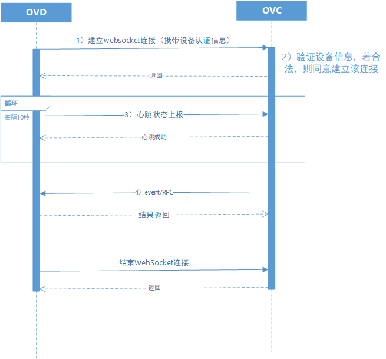

开放平台设备接入协议
======================

本文档描述了 `开放平台 <http://>`_ 与本地视音频设备的信令接入协议，
通过本协议，开放平台可以获得设备远端控制，直播远端观看，云端录像等能力。

1 名词解释
^^^^^^^^^^^^^

- OVS：open video system，开放视频云，一种基于物联网云计算技术的视频云系统；
  与传统NVR，DVR类似，OVS可以接入和管理各种带视频功能设备，支持直播、录像、点播、P2P实时通信等功能，
  但是与传统NVR，DVR的不同在于用户可以在互联网上观看视频，
  并且因为应用了云计算技术，OVS拥有近于无限的接入能力以及海量的并发直播点播请求；OVS主要由OVC与OVD两部分组成。

- OVC：open video cloud，运行在云端的开放视频云平台；
  提供API接口以及管理网页，用户可以随时通过互联网，以网页、APP、公众号、小程序等方式接入OVC，对其下属的摄像头进行管理，并进行直播点播。

- OVD：open video device, 开放视频设备，安装在客户现场的，具有与OVC通信能力的视频设备，如摄像头，门铃，音箱等，OVD通过“开放协议”接入OVC，并接受OVC的管理。

- Channel：OVD上的视频通道；
  一般一路摄像头为一条channel。如果OVD为摄像头，则只有一条通道，且通道号必须为0；
  如果IVT为NVR/DVR，则会有多条通道，每条通道代表一个NVR管理下的摄像头。

- OVS DAP：OVS device access protocol, OVD与OVC之间采用的接入信令通信协议，简称DAP

2 协议特性
^^^^^^^^^^^^

OVS DAP底层基于TCP/IP的WebSocket，应用层为基于JSON的自定义协议。

.. _`websocket URL`:

websocket URL::

  ws://<OVC domain:port>/ovc?login_code=<OVD设备ID>&login_passwd=<OVD接入密码>&hardware_model=<OVD的硬件型号>&firmware_model=<OVD的固件版本号>&sdk=<SDK版本号>

OVD通过上述URL主动连接并登录OVC平台，其中“OVD设备ID”以及“VD接入密码”是平台指定的，因此IVT需要提供方法配置这两个参数，以便在连接OVC时使用；
如果URL中给定的设备ID与接入密码与平台配置不符，登录会失败。
“OVD的硬件型号”与“OVD的固件版本号”由OVD厂家自定义，主要用于后期问题追踪，以及用于支持平台远程固件升级。
“SDK版本号”是当前使用的ovdsdk的版本号，由SDK内部填写，没有使用ovdsdk可以不提供此参数。
另外，WebSocket的子协议为空，无需指定。

应用层协议的基本通信类型包括RPC与event（事件通知）两种：

1. RPC: RPC为一应一答模式；通信中的两个端点均可以发起RPC请求；在单一方向上，请求接收/回应方，必须根据请求到达的顺序来处理并回应请求；
   两个方向上RPC请求有个各自的序列号，且独立计数；任一方向上的RPC请求与响应，不受另一方向上是否有RPC请求正在进行的影响。

2. event: 事件通知是没有应答的；通信中的两个端点均可以给对方发送事件通知。

2.1 接入流程
++++++++++++++++

1. OVD向OVC发起websocket连接，并携带上login_code，login_password等信息。

2. OVC侧在接收到请求后，验证OVD身份，若通过，则与OVD建立websocket连接。

3. OVD每10秒向OVC发送一个keepalive请求，在keepalive中携带OVD的状态，以及其下摄像头的状态信息。

4. 根据业务安排，OVD与OVC可以进行各种RPC与event的交换。

2.2 异常处理
+++++++++++++++++

当通讯的一端发现如下异常时，需主动断开websocket连接：

1. 收到的RPC response的seq与期待的seq（序列号）不一致时

2. RPC相应超时，当RPC发起方发现对端在20秒后仍然没有响应请求

3. 数据包格式不正确

另外，WebSocket重连并不认为是设备下线，只有当OVC在30秒内没有收到该OVD的信息，才认为OVD下线

3 OVD开发指引
^^^^^^^^^^^^^

对于摄像机、NVR等OVD生产厂家，如希望自己的设备能够接入OVC平台，通过平台获得远程控制与播放等功能，则需要在设备中实现本文档描述的协议。
OVD设备并不需要支持本文档中罗列的所有RPC/event方法，OVD设备厂家可以根据自己设备的能力以及应用的业务场景选择实现部分功能。

因为本协议使用的协议是基于WebSocket以及JSON这两个非常通用的标准，因此只要根据自己设备的情况，选用合适的开源库便可非常快速的实现通信。

3.1 最小实现
+++++++++++++++

1. OVD需要支持以websocket方式连接并登录平台，请参考 `websocket URL`_ .

2. OVD能够在与平台链接断开后定期主动尝试重连

3. OVD需要支持每10秒向平台发送 `Keepalive`_ .

4. OVD需要接受平台下发的`启动推流 `LivePublish`_ 请求

5. OVD需要接受平台下发的`结束推流 `LiveStopPublish`_ 请求

6. OVD需要能够正确处理异常情况 `异常处理 <2.2 异常处理>`_

7. OVD需要提供配置平台域名、端口、登录名与登录密码的方法（如通过摄像机web管理端）

3.2 推荐实现
+++++++++++++++

1. 如希望用户能够通过云平台获取摄像机的本地地址，以便用户本地登录设备，可考虑实现 `获取设备信息 <DevInfo>`_ 请求

2. 如果摄像机支持云台或缩放功能，推荐实现 `云台控制 <CtrlPTZ>`_

3. 如果希望用户能够远程重启设备，推荐实现 `重启设备 <RebootChannel>`_

3.3 调试方法
+++++++++++++++

为方便OVD开发人员调试协议，我们实现了一个云端的模拟平台，支持OVD登录，并能与OVD进行简单的通信，开发人员可以在浏览器中监控
模拟平台与OVD之间的所有应用层协议数据的交换，同时支持通过浏览器向OVD下发自定义的协议数据包。

该模拟平台的网页登录URL为: http://<domain>/?login_code=<OVD登录名>

设备的ws登录URL为： ws://<domain>/ovc?login_code=<OVD登录名>&login_passwd=<OVD登录密码>

只要保两个URL中的<OVD登录名>是相同的，就能从网页中看到设备与模拟平台的协议数据交互。

如需要使用该工具，请与我们取得联系。

4 应用层协议数据包格式
^^^^^^^^^^^^^^^^^^^^^^^^^^

此处数据包指的是应用层协议的数据包，即websocket的payload/message。数据包使用JSON标准进行串行化。

4.1 RPC request
+++++++++++++++++

RPC请求包的格式: ::

  {
    "req": <字符串，必填，请求的RPC方法>,
    "params": <JSON对象，可选，RPC方法的参数；当方法没有参数时，此域不存在>,
    "seq": <整数，必填，RPC的序列号；每发送一次请求，+1>
  }

4.2 RPC调用成功的response
+++++++++++++++++++++++++++++++

当RPC调用成功，应答包的格式: ::

  {
    "seq": <整数，必填，RPC的序列号；与对应的RPC请求的序列号一致>,
    "resp": <JSON对象，必选，应答内容>
  }

4.3 RPC调用失败的response
++++++++++++++++++++++++++++++++

当RPC调用失败，应答包的格式: ::

  {
    "seq": <整数，必填，RPC的序列号；与对应的RPC请求的序列号一致>,
    "err": {
      "code": <整数，必填，错误码>,
      "msg": <字符串，必填，错误信息>
    }
  }

通用的error code

==========     ============
code            备注
==========     ============
1               内部系统错误
11              码流过大
12              参数错误
13              配置不支持
101             不支持的RPC方法
102             channel不存在
103             channel不在线
==========     ============

4.3 事件通知
+++++++++++++++++

事件通知包的格式 ::

  {
    "event": <字符串，必填，事件名称>,
    "params": <JSON对象，可选，参数；当没有参数时，该域不存在>
  }

5 协议方法
^^^^^^^^^^^^^^^^^^^^^^^^^^^^^

5.1 设备心跳上报
+++++++++++++++++

Keepalive
-----------

OVD利用该方法定期向OVC报告工作状态，OVC以此作为OVT仍然在线的依据，同时OVD通过等待OVC的应答来判断与IVC的连接状态。
OVC在30秒内没有收到OVD的信息则认为OVD下线，建议10秒左右上报一个心跳。

类型： ::

  RPC

方向： ::

  OVD -> OVC

参数： ::

  {
    "state": <必填，整数；OVD的状态，1：在线，2：升级中，3：异常>
    "channels": [
      {
        "channel": <必填，整数>,
        "state": <必填，整数；该channel的状态，0：离线，1：在线>,
        "stream_id": <可选，字符串；当前channel正在进行的推流对应的云端stream_id，即LivePublish方法中给定的stream_id，空字符串或该域不存在表示该channel没有进行推流>
        "record_session": <可选，字符串；当前channel正在进行的录像的云端session ID，录像session ID为StartCloudRecord请求中的session_id域；空字符串或该域不存在表示没有进行云录像>
        "alarm": <可选，整数；当前报警状态flags，每一位（从0开始计数）对应一种报警类型，当相应位为1时，标示该类型的报警被触发；参考报警状态flags>
      }
    ]
  }

成功应答： ::

  {}
  

报警flags

==========     ============
报警类型           位数
==========     ============
外部报警        第2位
移动侦测        第3位
拌网            第4位
哭声侦测        第5位
人脸识别        第6位
声音侦测        第7位
低电            第8位
撬锁            第9位
按铃            第10位
人形侦测        第11位
==========     ============  

5.2 获取服务器信息
++++++++++++++++++

GetServerInfo
------------------

OVD利用该方法获取云平台的相关地址信息。

类型： ::

  RPC

方向： ::

  OVD -> OVC

参数： ::

  无

成功应答： ::

  {
    "hibernation": <可选，字符串；休眠服务地址，格式为：IP:port。空字符串或不存在表示不支持休眠>,
    "hb_interval": <可选，整数：设备心跳间隔，单位秒，该字段不存在则默认为10秒>
  }

5.3 绑定信息上报
++++++++++++++++++

Bind
-----------

OVD利用该方法向OVC发送（用户/租户）绑定请求。

类型： ::

  EVENT

方向： ::

  OVD -> OVC

参数： ::

  {
    "bind_id": <必填，字符串：请求绑定的ID>
  }

5.4 设备远程维护
++++++++++++++++

RebootChannel
-----------------

OVC可以通过该方法请求OVD重启指定通道，若OVD不支持单独重启某个通道，可以实现为重启设备。

类型： ::

  EVENT

方向： ::

  OVC -> OVD

参数： ::

  {
    "channel": <必填，整数>
  }

RebootDevice
-----------------

OVC可以通过该方法请求OVD重启设备。

类型： ::

  EVENT

方向： ::

  OVC -> OVD

参数： ::

  无

Reschedule
-----------------

OVC可以通过该方法请求OVD重新获取OVC接入URL

类型： ::

  EVENT

方向： ::

  OVC -> OVD

参数： ::

  无

  
UpgradeFirmware
-------------------

OVC可以通过该方法通知OVD升级固件，收到该事件后OVD即自行执行下载升级工作。

类型： ::

  EVENT

方向： ::

  OVC -> OVD

参数： ::

  {
    "firmware_model": <必填，字符串；最新固件的版本号>,
    "url": <必填，字符串；最新固件的http下载地址>
  }

QueryUpgrade
-------------------

OVC可以通过该方法查询OVD当前的升级状态，以及进度百分比

类型： ::

  RPC

方向： ::

  OVC -> OVD

参数： ::

  无
  
成功应答： ::

  {
    "upgrade_status": <必填，字符串；当前升级状态，可选值为notstart/donwloading/installing/done/error>
    "progress": <必填，整数；当前升级进度， 0-100>
  }  

SyncTime
-----------------

OVC可以通过该方法设置OVD的日历时间。

类型： ::

  RPC

方向： ::

  OVC -> OVD

参数： ::

  {
    "datetime": <必填，字符串；格式yyyy-MM-ddTHH:mm:ss，例子：2016-12-05T02:15:32>,
    "offset": <必填，整数；可接受的偏差，单位秒，若摄像机时间与上面给定的时间的偏差在offset秒之内，则摄像机无需同步时间>,
  }  

成功应答： ::

  {}

QueryTime
-----------------

OVC可以通过该方法查询设备当前日历时间

类型： ::

  RPC

方向： ::

  OVC -> OVD

参数： ::

  无
  
  
成功应答： ::

  {
    "datetime": <必填，字符串；格式YY-MM-DDTHH:MM:SS，例子：2016-12-05T02:15:32>,
  }  

DevInfo
-----------------

OVC可以通过该方法查询设备当前运行信息

类型： ::

  RPC

方向： ::

  OVC -> OVD

参数： ::

  无
  
  
成功应答： ::

  {
    "dev_id": <必填，字符串： 设备ID号，16位10进制数>
    "hardware_model": <必填，字符串： 设备型号>
    "firmware_model": <必填，字符串： 设备固件版本号>
    "last_upgrade_datetime": <必填，字符串；最后成功升级的日期时间，格式YY-MM-DDTHH:MM:SS，例子：2016-12-05T02:15:32>,
    "wifi_ssid": <可选，字符串： 设备当前连接的wifi的ssid, 该字段不存在或空串表示设备未连接wifi>
    "wifi_signal": <可选，整数： 设备当前wifi的信号强度, 0-100, 当wifi_ssid不为空时有效>
    "up_bandwidth": <可选， 整数：设备探测到的上行最大带宽，单位bps，不存在则表示上行带宽未知>
    "down_bandwidth": <可选， 整数：设备探测到的下行最大带宽，单位bps，不存在则表示下行带宽未知>   
    "ip_addr": <可选，字符串：设备当前内网IP地址，不存在表示IP地址未知>
    "mac_addr": <可选，字符串：设备网卡的mac地址，不存在表示IP地址未知>
    "battery": <可选，整数： 设备当前设备电池电量, 0-100, 该字段不存在表示设备不支持电池供电>
  }  

FormatDisk
-----------------

OVC可以通过该方法对设备的SD卡进行格式化。

类型： ::

  RPC

方向： ::

  OVC -> OVD

参数： ::

  无 

成功应答： ::

  {}

ResetConfig
-----------------

OVC可以通过该方法对设备的配置进行重置，设备收到该请求后，应该将所有配置恢复到出厂状态（包括wifi配置），但不能断开当前网络连接，并返回成功应答。
OVC稍后会再下发一个重启指令将设备重启，默认配置生效。

类型： ::

  RPC

方向： ::

  OVC -> OVD

参数： ::

  无 

成功应答： ::

  {}

5.5 实时流媒体推送
+++++++++++++++++++

LivePublish
-----------------

OVC可以通过该方法请求OVD 推送一条实时媒体流到指定URL；
同一个通道同一时间只应该推送一条流，推流过程中如果再次收到平台的推流请求，如果stream_id和正在推送的码流一致，则直接返回成功，
否则，应该停止当前的推流然后根据新的参数重新推流。
通道一旦开始推流，则需在发送的Keepalive中将channel的state改为直播中，同时将channel的stream_id置为给定的stream_id；

类型： ::

  RPC

方向： ::

  OVC -> OVD

参数： ::

  {
    "channel": <必填，整数>,
    "url": <必填，字符串；流推送的首选目标URL1>
    "stream_id": <必填，字符串；OVC用来标识这条流的ID>,
    "max_bitrate": <必填，整数，单位bit/s；用来表示最大允许的码率，0表示没有限制，若相应流码率大于该值，需返回失败>
  }

成功应答（即推流成功，或该stream已经存在）： ::

  {}

可能的error code:

- 11: 码流过大
- 12: 参数错误
- 101: 不支持的RPC方法

LiveStop
------------------

OVC可以通过该方法请求OVD结束正在推送的实时媒体流。

类型： ::

  RPC

方向： ::

  OVC -> OVD

参数： ::

  {
    "stream_id": <必填，字符串；LivePublish时给的stream_id>,
    "channel": <必填，整数>
  }

成功应答（成功结束，或该流不存在）： ::

  {}

5.6 录像直存
+++++++++++++++

StartCloudRecord
------------------

OVC可以通过该方法请求OVD启动录像并上传录像至云存储。
同一个通道同一时间只应该进行一个云录像会话，在云录像进行过程种，如果再次收到平台的云录像请求，如果session_id和正在执行的云录像会话一致，则表示重复请求，直接返回成功，
否则，应该停止当前的云录像会话，然后根据新的参数重新创建。
通道一旦开始云录像，则需在发送的Keepalive中将channel的的record_session置为给定的本请求中的参数session_id。

类型： ::

  RPC

方向： ::

  OVC -> OVD

参数： ::

  {
    "session_id": <必填，字符串；OVC相应的录像会话ID>,
    "channel": <必填，整数>,
    "max_bitrate": <可选，整数，单位bit/s；用来表示最大允许的码率，0或者字段不存在则表示没有限制，若相应流码率大于该值，需返回失败>，
    "seg_duration": <必填，整数；分片的时长，单位秒>,
    "seg_max_size": <必填，整数；每个分片的最大尺寸，单位byte>,
    "seg_max_count": <必填，整数；在内存中缓存的分片最大数量>,
    "prerecord_seconds": <可选，整数；预录秒数，单位秒，若该字段非0，则表示为报警预录，若该字段不存在或者0表示正常录像>,
    "start_ts": <必填，浮点数；第一个分片的时间戳（单位：秒），若给定0或者负数，则OVD使用设备自身的时间>,
    "cbk_url": <必填，回调URL，最长256字节；录像模块通过请求该URL，获取录像上传地址>
  }

成功应答： ::

  {}

可能的error code:

- 11: 码流过大
- 12: 参数错误
- 101: 不支持的RPC方法

StopCloudRecord
-----------------

OVC可以通过该方法请求OVD结束录像。

类型： ::

  RPC

方向： ::

  OVC -> OVD

参数： ::

  {
    "session_id": <必填，字符串；OVC相应的录像会话ID>,
    "channel": <必填，整数>
  }

成功应答（成功结束，或该录像session不存在）： ::

  {}

5.7 报警通知
+++++++++++++++

AlarmNotify
--------------------

OVD可通过该方法向OVC上报报警事件的开始/结束。OVD收到

类型： ::

  RPC

方向： ::

  OVD -> OVC

参数： ::

  {
    "channel": <必填，整数；通道号>,
    "timestamp": <必填，整数；报警开始/或者结束的时间戳（从epoch计起的秒数）>
    "type": <必填，整数；报警类型：见下表>,
    "state": <必填，字符串枚举，start/end；报警状态：start，开始；end，结束>,
    "desc": <必填，字符串；描述信息>
  }

成功应答： ::

  {
    "pic_upload_url": <选填，字符串；报警相关图片的上传URL, 若报警不关联图片，则不需要上传，如果该字段为空串或者字段不存在，表示不需要上传相关图片>
  }

==========     ============
类型            type值
==========     ============
外部报警        2
移动侦测        3
拌网            4
哭声侦测        5
人脸识别        6
声音侦测        7
低电            8
撬锁            9
按铃            10
人形侦测        11
==========     ============  

5.8 云台控制
+++++++++++++++

CtrlPTZ
--------------

OVC可以通过该方法操作摄像头的云台。

类型： ::

  EVENT

方向： ::

  OVC -> OVD

参数： ::

  {
    "channel": <必填，整数>,
    "op": <必填，字符串；云台的操作码，具体参见下表>,
    "value": <可选，整数；意义见下表>
  }

==================   =============   ===============================================
op                    操作             value
==================   =============   ===============================================
up                    上                可选，整数，速度，0-100，0最慢，100最快，默认50
down                  下                同上
left                  左                同上
right                 右                同上
upleft                左上              同上
upright               右上              同上
downleft              左下              同上
downright             右下              同上
zoomin                拉近              同上
zoomout               拉远              同上
stop                  停止              可选，整数，但数值没有意义
goto_preset           跳转预置位        预置位ID， 0-255
set_preset            设置预置位        同上
clear_preset          清除预置位        同上        
up_step               单步上            可选，整数，单步步长，0-100，0最小，100最大，默认0
down_step             单步下            同上
left_step             单步左            同上
right_step            单步右            同上
upleft_step           单步左上          同上
upright_step          单步右上          同上
downleft_step         单步左下          同上
downright_step        单步右下          同上
zoomin_step           单步拉近          同上
zoomout_step          单步拉远          同上       
==================   =============   ===============================================

GetPTZPresetList
-----------------------

OVC可以通过该命令获取摄像头的预置点列表

类型： ::

  RPC

方向： ::

  OVC -> OVD

参数： ::

  {
    "channel": <必填，整数>
  }

成功应答： ::

  [
    {
      "id": <必填，整数；预置点ID，0-255>
    }
    ...
  ]

5.8 远程配置
+++++++++++++++

大部分需要OVD持久化保存的配置都是通过远程配置的方式下发到OVD，OVD的远程配置抽象为一份JSON文档，OVC下发配置时，
只需要下发需要修改的字段，没有改变的字段可以不下发。

.. _`OVD配置文件定义`:

配置文件定义： ::

  {
    "channls": {
      "通道号": {           //通道号（非负整数）作为键
        "video_encoding":{      
          "encoder": <必填，可读可写，字符串：视频编码器名称，目前仅支持h264>
          "quality": <必填，可读可写，字符串；可选值为：ld、sd、hd、fhd，分别代表低清，标清，高清，全高清>
          "fps": <可选，只读，整形：每秒帧数>
          "bitrate": <可选，只读，整形：码流比特率>
          "width": <可选，只读，整形：图像宽度像素>
          "height": <可选，只读，整形：图像高度像素>
          "gop": <可选，只读，整形：码流gop,单位帧>
          "rsk_encrypt": <可选，客端可写，布尔型：是否对视频码流进行rsk加密，默认为false>
        }
        "audio_encoding":{      
          "encoder": <必填，可读可写，字符串：音频编码器名称，目前仅支持aac>
          "sample_rate": <可选，只读，整形：采样率，即每秒钟采用数目，合法值8000/16000/32000/44100/48000>
          "bitrate": <可选，只读，整形：码流比特率>
          "bits_per_sample": <可选，只读，整形：位宽，即每个sample的比特数>
          "sample_per_frame": <可选，只读，整形：每一帧中包含的sample数，AAC算法标准固定为1024>
          "channel": <可选，只读，整形：声道数>   
        }       
        "image":{
          "horflip":  <必填，可读可写, 布尔型：水平翻转>
          "verflip":  <必填，可读可写, 布尔型：垂直翻转>     
        }
   
        "alarms":{
          "io":{           //外部报警配置，若OVD不具备该能力，该字段不存在
            "on":  <必填，可读可写,布尔型：使能开关>
            "sensitivity":  <必填，可读可写,整型：探测灵敏度， 0 - 100>
          }
          "face":{          //人脸识别配置，若OVD不具备该能力，该字段不存在
            "on":  <必填，可读可写,布尔型：使能开关>
            "sensitivity":  <必填，可读可写,整型：探测灵敏度， 0 - 100>          
          }
          "cry":{           //哭声侦测配置，若OVD不具备该能力，该字段不存在
            "on":  <必填，可读可写,布尔型：使能开关>
            "sensitivity":  <必填，可读可写,整型：探测灵敏度， 0 - 100>  
          }       
          "voice":{         //声音侦测配置，若OVD不具备该能力，该字段不存在
            "on":  <必填，可读可写,布尔型：使能开关>
            "sensitivity":  <必填，可读可写,整型：探测灵敏度， 0 - 100>    
          }
          "motion":{        //移动侦测配置，若OVD不具备该能力，该字段不存在
            "on":  <必填，可读可写,布尔型：使能开关>
            "sensitivity":  <必填，可读可写,整型：探测灵敏度， 0 - 100>    
          }
          "cross":{         //拌网配置，若OVD不具备该能力，该字段不存在
            "on":  <必填，可读可写,布尔型：使能开关>
            "sensitivity":  <必填，可读可写,整型：探测灵敏度， 0 - 100>    
          }
          "body":{         //人形侦测配置，若OVD不具备该能力，该字段不存在
            "on":  <必填，可读可写,布尔型：使能开关>
            "sensitivity":  <必填，可读可写,整型：探测灵敏度， 0 - 100>    
          }          
        }
        "audio_out_volume": <可选，可读可写，整数：扬声器输出音量，0-100，若该字段不存在表示设备不支持音量调节>
        "trace":  <可选，可读可写,布尔型：移动跟踪, 若该字段不存在，则表示设备不支持移动追踪>
      }
      ...
    }
    "log_level": <必填，可读可写，整数：输出日志级别，0:trace/1:debug/2:info/3:warn/4:error/5:fatal>
    "tz": <必填，可读可写，整数：时区号，东为正数，西为负数。例如东八区为+8>
    "auto_reboot": {   //自动维护（重启）能力，若OVD不具备该能力，则该字段不存在
      "on": <必填，可读可写,布尔型：使能开关>
      "cycle": <必填，可读可写,整型：自动维护（重启）的最短周期，单位秒，例如7天自动重启，可以设置为604800>    
      "start": <必填，可读可写,整型：自动维护（重启）开始时间（当天的秒数），单位秒，例如凌晨2点，即7200，设备可在start到end时间内随机选择一个时间重启>    
      "end": <必填，可读可写,整型：自动维护（重启）结束时间（当天的秒数），单位秒，例如凌晨6点，即21600，设备可在start到end时间内随机选择一个时间重启>    
    }

    
  }

GetConfig
-----------------------

OVC可以通过该命令获取OVD的配置

类型： ::

  RPC

方向： ::

  OVC -> OVD

参数： ::

  无

成功应答： ::

  参考 `OVD配置文件定义`_ 

SetConfig
-----------------------

OVC可以通过该命令远程设置OVD的配置，参数中只需要包含修改的配置，不需要修改的配置不需要包含。

类型： ::

  RPC

方向： ::

  OVC -> OVD

参数： ::

  参考 `OVD配置文件定义`_ 

成功应答： ::

  {}

可能的error code

==========     ============
code            备注
==========     ============
12              参数错误
13              配置不支持
102             channel不存在
==========     ============

5.9 截图
+++++++++++++++
  
Snapshot
-------------

OVC可以通过该方法控制OVD截取当前的视频画面。OVD完成截图图片上传成功后，返回应答。OVC收到应答时，相应的截图图片已经上传的服务器。

类型： ::

  RPC

方向： ::

  OVC -> OVD

参数： ::

  {
    "channel": <必填，整数>,
    "url": <必填，字符串；图片上传的http url>,
  }

成功应答： ::

  {}  
  

5.10 播放音乐
+++++++++++++++

AudioOutPlay
-----------------------

OVC可以通过该命令启动OVD播放音乐。OVD收到该指令后应该自行下载音乐文件并播放

类型： ::

  EVENT

方向： ::

  OVC -> OVD

参数： ::

  {
    "channel": <必填，整数: 通道号>
    "url": <必填，字符串；音乐文件的URL>
  }

AudioOutCtrl
-----------------------

OVC可以通过该命令控制OVD播放。

类型： ::

  EVENT

方向： ::

  OVC -> OVD

参数： ::

  {
    "channel": <必填，整数: 通道号>
    "op": <必填，字符串；播放控制指令，目前支持stop/pause/resume>
  }

AudioOutQuery
-----------------------

OVC可以通过该命令查询OVD播放状态。

类型： ::

  RPC

方向： ::

  OVC -> OVD

参数： ::

  {
    "channel": <必填，整数: 通道号>
  }

成功应答： ::

  {
    
    "status": <必填，字符串；播放状态，stopped：未开始；pausing： 暂停中；playing：播放中>
    "url": <可选，字符串；当前正在播放的音乐文件的URL，该域不存在或者空串表示当前未播放>
  }

5.11 休眠控制
+++++++++++++++

KeepAwaken
-------------

OVC可以通过该方法阻止设备（及指定通道）在指定时间内休眠，或者唤醒设备（及指定通道）当前所有休眠的部件。
OVD收到此指令后，应该在指定的过期时间内，保证设备（及指定通道）能够完全正常上电工作。

类型： ::

  RPC

方向： ::

  OVC -> OVD

参数： ::

  {
    "channel": <必填，整数>,
    "expired": <必填，整数：保持上电的最短时间，单位秒>,
  }

成功应答： ::

  {}

5.12 电量变化上报
+++++++++++++++

BatteryChange
----------------

OVD可以通过该方法向OVC上报当前的电量，一般电量百分比变化时可以发送该通知事件。

类型： ::

  EVNET

方向： ::

  OVD -> OVC

参数： ::

  {
    "battery": <必填，整数： 设备当前设备电池电量百分比, 0-100>
  }

5.13 设备能力集
+++++++++++++++

OVC可以通过以下指令获取OVD支持的功能集合，能力集使用json格式表示，目前支持的能力定义如下

.. _`OVD能力集定义`:

能力集定义： ::

  {
    "ptz": <布尔型：是否支持云台控制能力>,
    "battery": <布尔型：是否电池供电>,
    "media_protocol": <字符串；流媒体传输协议，目前可选值为：rtmp、srt>, 
    "audio_out": <布尔型：是否支持音乐输出>,
    "voice_out": <布尔型：是否支持对讲输出>,
    "cloud_record": <布尔型：是否支持录像切片直存>,
    "trace": <布尔型：是否支持移动跟踪>,
    "alarms": { // 告警上报相关能力
        "io": <布尔型：是否支持外包报警>,
        "face": <布尔型：是否支持人脸侦测>,
        "cry": <布尔型：是否支持哭声侦测>,
        "voice": <布尔型：是否支持声音侦测>,
        "motion": <布尔型：是否支持移动侦测>,
        "body": <布尔型：是否支持人形侦测>,
        "cross": <布尔型：是否支持拌网侦测>,
    },
    "https": <布尔型：是否支持HTTPS，若不支持，则图片和录像切片上传采用HTTP模式>,
  }

GetCap
-----------------------

OVC可以通过该命令获取OVD的能力集

类型： ::

  RPC

方向： ::

  OVC -> OVD

参数： ::

  无

成功应答： ::

  参考 `OVD能力集定义`_ 

5.14 日志管理
+++++++++++++++

LogUpload
-----------------------

OVC可以通过该命令控制OVD上传相关本地日志，供调试分析使用。OVD收到该指令后，通过HTTP PUT方法将指定范围日志上传到服务器。
若指定范围的日志已经滚动删除，则使用尽力原则上传剩余的日志。若指定范围没有任何日志记录，应上传一个长度为0的日志文件。

类型： ::

  EVENT

方向： ::

  OVC -> OVD

参数： ::

  {
    "start": <必填，字符串；日志记录开始时间，格式yyyy-MM-ddTHH:mm:ss，例子：2016-12-05T02:15:32>,
    "end": <必填，字符串；日志记录结束时间，格式yyyy-MM-ddTHH:mm:ss，例子：2016-12-06T02:15:32>,
    "url": <必填，字符串；日志上传的URL，设备通过PUT方法上传相应的日志文件>
  }

