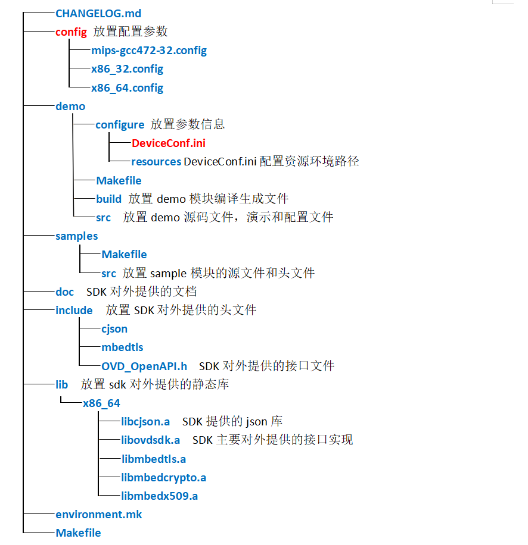
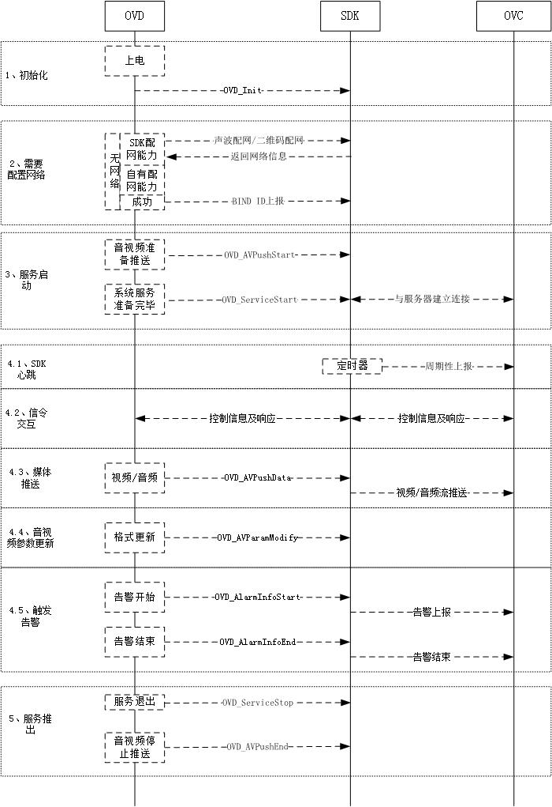
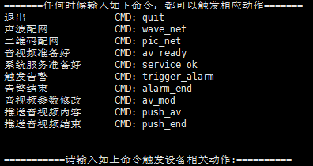

# SDK架构说明及接入方法
## 一、SDK目录及说明
### 1、目录架构
	SDK目录架构如下：
	

### 2、目录说明
#### 2.1 config目录
    功能：主要配置编译连接时的参数

	config目录里包含XXX(设备型号标识).config , 在这个config文件内容参考如下：
	#############moudule（libovd.a 包含的子模块情况)#########################
	CONFIG_MODULE_helloworld=y
	CONFIG_MODULE_libwebsocket=y
	CONFIG_MODULE_cJSON=y
	CONFIG_MODULE_DME=y
	CONFIG_MODULE_OPENAPI=y
	CONFIG_MODULE_log=y
	CONFIG_MODULE_HTTPCLIENT=y
	CONFIG_MODULE_P2P=y
	CONFIG_MODULE_wave=y
	CONFIG_MODULE_zbar=y
	CONFIG_MODULE_stream=y
	CONFIG_MODULE_picupload=y
	###########sdk(当前libovd.a (SDK) 的版本)################################
	CONFIG_SDK_VERSION=V1.0.0
	
	#############################################(当前辅助编译开关和调试开关)
	CONFIG_BUILD_SDK_WHOLE=y
	CONFIG_DEBUG_MODE=y
	
	###########environment####################
	CONFIG_CUSTOM_NAME=rock3308 (设备标志字符串)
	CONFIG_EXTERNAL_TOOL_CHAIN=y (是否用非系统默认gcc)
	TOOLCHAIN_BIN_PATH=/opt/ovd_toolchain/rockchip-3308/prebuilts/gcc/linux-x86/aarch64/gcc-linaro-6.3.1-2017.05-x86_64_aarch64-linux-gnu/bin (交叉工具链gcc的二进制路径)
	CROSS_COMPILE=aarch64-linux-gnu-   (交叉工具链gcc前缀)
	CROSS_SYSROOT=/opt/ovd_toolchain/rockchip-3308/prebuilts/gcc/linux-x86/aarch64/gcc-linaro-6.3.1-2017.05-x86_64_aarch64-linux-gnu/aarch64-linux-gnu/libc (交叉工具链的逻辑库地址)
	CUSTOM_CFLAGS=                   (厂商设备需特定的编译参数)
	
	若厂商已配置好自己的交叉工具链GCC环境，例如默认gcc 直接指向 交叉工具链，则厂商只需将CONFIG_EXTERNAL_TOOL_CHAIN=N 即可，不需指定TOOLCHAIN_BIN_PATH, CROSS_COMPILE, CROSS_SYSROOT 这3个参数，否则
	厂商需将CONFIG_EXTERNAL_TOOL_CHAIN=y, 然后根据自己的编译环境来配置TOOLCHAIN_BIN_PATH，CROSS_COMPILE，CROSS_SYSROOT
	
	CUSTOM_CFLAGS 是设备特定的编译参数，由厂商提供和填入。

#### 2.2 environment.mk 和 Makefile 文件
	sdk主目录上的主Makefile

#### 2.3 include目录
	放置sdk对外提供的头文件
	OVD_OpenAPI.h：SDK对外提供的接口文件

#### 2.4 lib目录
	放置sdk对外提供的静态库libovd.a和libcjson.a

	libovd.a: SDK主要对外提供的接口实现
	libcjson.a: SDK提供的json库
	*注：libcjson.a 提供了通用json接口实现，若厂商自带有cjson库，后期移植时可自行斟酌是否引用SDK提供的libcjson.a*
	 
#### 2.5 doc目录
	sdk对外提供的文档

#### 2.6 demo目录
	功能：demo模块执行文件将模拟为一个设备，可进行注册、配网、推流、告警等一整套流程。

	src:   放置demo 源码文件, 演示和配置文件
	Makefile: demo 模块的 Makefile
	build: 放置demo模块编译生成文件
	
#### 2.7 samples目录
	功能：samples模块为各自流程的模拟程序，每个子程序可独立执行。提供集成参考。

	include, src： 放置sample模块的源文件和头文件
	Makefile:  samples模块的Makefile
	configure,resources:  演示和配置文件
	build: 放置sample模块编译生成文件
	
	sample模块提供几个情景下的sample实例：
		1.sample_init   演示sdk初始化话动作
		2.sample_pic_net 演示sdk 二维码识别配网动作
		3.sample_wave_net 演示sdk 声波配网动作
		4.sample_service_ok 演示sdk 连接云服务器
		5.sample_configuration 演示sdk连接云服务器并进行简单的报文交互
		6.sample_alarm 演示sdk基础告警流程
		7.sample_av 演示sdk基础推流流程

## 二、接口使用流程说明
### SDK接入的调用流程图（请关注流程图后的注意事项）
   
### 接入流程注意事项
   
- 建议设备按照流程图的步骤1、2、3、4、5进行接口调用，其中步骤4各子流程可以并行执行。
- 设备上电初始化后，若还未配置网络，则调用SDK提供的 *声波配网* 或者 *二维码配网* 方法进行配网；设备有自由配网方式，可以忽略SDK的方法。
- 若设备需要配网，且在设备在配网成功后，根据获取到的网络配置信息，调用SDK的方法OVD_DeviceBindInfo上报BIND ID。
- 若前期已经配网成功，建议在网络连接成功后，再调用步骤3，否则SDK连接服务器失败。
- 建议**保持步骤3的顺序**，因为启动服务后，服务器端可能会立即获取音视频参数，但设备还未上报音视频参数，导致服务器端异常重试，影响体验。
   
## 三、接入集成方法
## 1 详细的接口说明，请见OVD_OpenApi.h

## 2 集成说明
    1、拷贝ovdOpenApi的include及链接库到工程目录下（若无json库，也需要拷贝jison库）
    2、接口实现处，引用OVD_OpenApi.h
    3、Makefile中, -I 引入头文件
    4、Makefile中,  -l:libovd.a  -lpthread -lstdc++ -lm -lrt  引入lib库
    
## 3 集成SDK编译流程
	- 集成商首先在config目录下对XXX.config文件对TOOLCHAIN_BIN_PATH, CROSS_COMPILE, CROSS_SYSROOT, CUSTOM_CFLAGS进行修改，适配自己的编译环境
	- 在主目录上执行TARGET_BUILD=XXX make all ,XXX 为设备型号标识

## 四、demo使用流程
## 1 编译链接
1. demo模拟设备运行，其设备本身的参数配置在demo/configure目录下
2. demo模拟设备时的音视频内容，放置在demo/resource目录下，视频仅支持H264格式，音频仅支持AAC格式
3. 进入demo目录
4. 执行make命令
5. 编译成功后，生成的可执行文件在demo/build/x86_64/bin目录下

## 2 demo执行过程说明
1. 在demo/build/x86_64/bin目录下执行 ./demo，然后按照提示进行输入，引导程序继续执行
2. 首先会询问设备本身参数是否在demo/configure目录下准备好，若需要修改参数，请先修改完毕
3. 准备好设备参数后，输入y，设备进行启动，初始化SDK
4. 根据如下命令引导demo执行，
	- 若要推出，请执行quit命令
	- 执行 pic\_net 或者 wave\_net 进行配置网络
	- 执行 av_ready，设备准备好音视频参数
	- 执行 service_ok 通知SDK服务准备好，连接服务器
	- 如上系列命令成功启动了服务
	- 执行其他命令触发相关工作
	- demo执行过程中会有其他日志输出，若需要查看引导命令，请输入任何一个字符，回车即可

【注】**若需要服务器下发命令，请连接相关服务器端配合执行**

